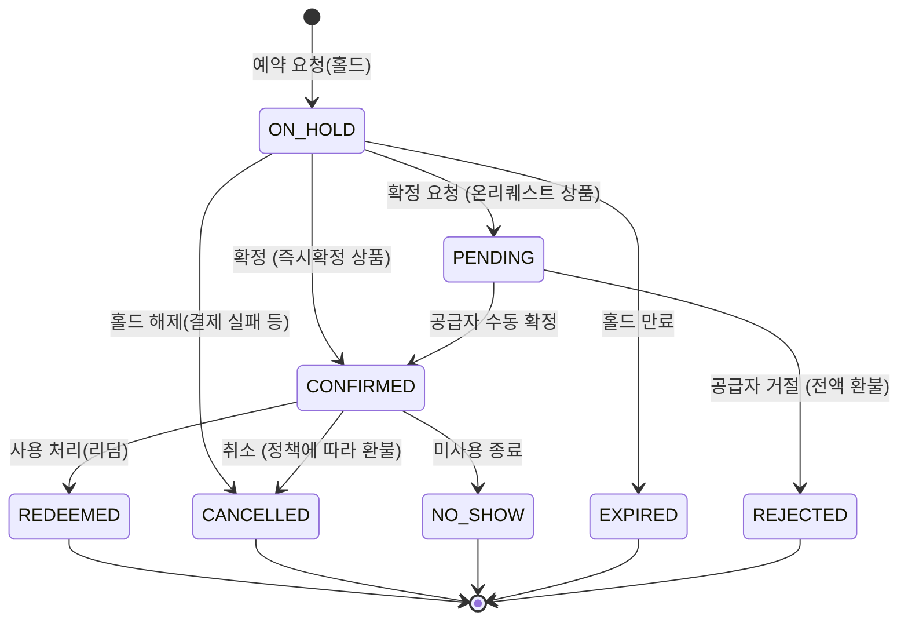

# 02. 카테고리별 가격·재고·판매 관리모델 정의

> 본 문서는 [01_OTA_카테고리_분석.md](01_OTA_카테고리_분석.md)에서 도출한 표준 카테고리 8축(C1~C8)에 대해, 공급자 시스템이 제공해야 할 **가격 관리 / 재고 관리 / 판매 관리** 모델을 정의한다. 시스템 요구사항 정의의 근간이 되는 문서다.

---

## 1. 공통 관리 모델 (전 카테고리 적용)

### 1.1 가격 관리 — 공통 원칙

#### 가격 3층 구조

모든 상품 가격은 3층으로 관리한다 (Klook OCTO pricing, ROLLER 연동 모델 기준):

| 가격 층 | 명칭 | 정의 | 용도 |
|---|---|---|---|
| 1 | **정가** (Original / RRP) | 현장 판매 정가, 할인 전 표시가 | 할인율 표시("30% off") |
| 2 | **판매가** (Retail / B2C) | 소비자 실제 결제가 | OTA 노출가, 직판가 |
| 3 | **공급가** (Net / B2B) | 공급자가 채널로부터 수취하는 도매가 | 정산 기준가 |

- 판매가와 공급가의 차이 = 채널 커미션 (OTA별 15~35%, 계약 협상)
- 채널별 가격 설정 2방식 지원 (KKday 방식): **고정가**(채널별 전용가 직접 입력) vs **할인율**(기준가 대비 % 자동 계산)

#### 가격 차원 (Price Dimensions)

가격은 다음 차원의 조합으로 결정된다:

```
가격 = f(Unit 유형, 날짜/시즌, 채널, 인원 구간, 통화)
```

| 차원 | 설명 | 예시 |
|---|---|---|
| **Unit 유형별** | 성인/아동/유아/시니어/학생/그룹 각각 가격. 무료 유닛도 존재(FREE_TICKET_REQUIRED: 무료지만 티켓 필요 — 유아) | 성인 50,000 / 아동 35,000 / 유아 0 |
| **시즌/요일별** | 날짜 범위 기반 시즌 가격(성수기/비수기), 요일별 가격(주중/주말), 특정일 가격(공휴일) | 7~8월 +20%, 주말 +10% |
| **채널별** | 채널마다 판매가·공급가 상이 | Klook 넷가 40,000 / 직판 50,000 |
| **인원 구간별(Tiered)** | 인원 수 구간에 따른 계단식 단가 (GYG tieredPricesByCategory) | 1–4명: 인당 60,000 / 5–9명: 인당 50,000 |
| **통화** | 상품 기준 통화 + 채널 통화 환산. KRW/JPY 등 소수점 없는 통화 처리 주의 | KRW 기준, USD 채널 자동 환산 |

- **세금 분리**: 가격에 포함된 세금 내역(includedTaxes)을 별도 관리 (부가세 등)
- **가격 유효성 보장**: 조회 시점 가격의 검증 토큰 발급(KKday guid 방식) 또는 예약 시 가격 재검증 — 조회~예약 사이 가격 변경으로 인한 분쟁 방지
- **프로모션/딜**: early bird(사전 예약 할인), last minute(임박 할인), 기간 한정 할인율 + 할인 적용 재고 한도(maxVacancies)

### 1.2 재고 관리 — 공통 원칙

#### 재고(가용성) 3유형

| 유형 | 코드 | 재고 단위 | 해당 카테고리 |
|---|---|---|---|
| **타임슬롯형** | START_TIME | 일자+시각(세션)별 정원(capacity) | 투어, 액티비티, 공연, 예약제 F&B |
| **일자형** | OPENING_HOURS | 일자별 수량 (운영시간 내 자유 입장) | 지정일 입장권 |
| **오픈데이트형** | FREESALE | 무제한 또는 총량(total cap), **유효기간** 속성 보유 | 오픈데이트 입장권, 패스, eSIM |

#### 재고 관리 요소

| 요소 | 정의 |
|---|---|
| **운영 스케줄** | 반복 규칙 기반 세션 생성 (예: 매일 09:00/14:00, 화요일 휴무) — 시즌별 스케줄 템플릿 |
| **정원(Capacity)** | 세션/일자별 최대 판매 수량. Unit 유형별 분리 정원 지원 (성인석 20 + 아동석 10, GYG vacanciesByCategory) |
| **잔여(Vacancy)** | 정원 − 확정 예약 − 유효 홀드. 실시간 계산 |
| **채널 배정(Allotment)** | 채널별 재고 할당 vs **공유재고**(전 채널 공용 풀) 선택. 공유재고가 기본, 특정 채널 보장 수량 필요 시 allotment |
| **컷오프(Cut-off)** | 판매 마감 시점 (예: 시작 24시간 전, 당일 17시) — 초 단위 정밀도(GYG cutoffSeconds) |
| **블록아웃(Blockout)** | 특정 일자/세션 판매 중지 (휴무일, 정비일, 전세 행사) |
| **오버부킹 방지** | 홀드 포함 잔여 검증 + 원자적 차감. 홀드 만료 시 자동 복원 |
| **채널 동기화** | 재고 변경 시 채널로 push(매진·재개 알림) 또는 채널이 실시간 pull — 채널별 상이 (→ [05_채널연동_API_설계.md](05_채널연동_API_설계.md)) |

### 1.3 판매 관리 — 공통 라이프사이클

#### 예약 상태머신 (OCTO 표준 기반)



| 상태 | 정의 | 재고 영향 |
|---|---|---|
| `ON_HOLD` | 임시 홀드. 만료시각(expiration) 보유, 연장 가능 | 잔여 차감 (임시) |
| `PENDING` | 온리퀘스트 확정 대기. SLA(24–48h) 내 공급자 응답 필요 | 잔여 차감 |
| `CONFIRMED` | 확정. 바우처/티켓 발급 | 잔여 차감 (확정) |
| `REJECTED` | 공급자 거절. 전액 환불 | 잔여 복원 |
| `EXPIRED` | 홀드 만료 | 잔여 복원 |
| `CANCELLED` | 취소. 취소정책에 따라 환불액 계산 | 잔여 복원 |
| `REDEEMED` | 사용 완료. **취소 불가**, 정산 대상 확정 | — |
| `NO_SHOW` | 미사용 종료. 정책에 따라 정산 대상 | — |

#### 판매 관리 기능 (전 카테고리 공통)

| 기능 | 정의 |
|---|---|
| **예약 접수** | 채널 API 유입 + 어드민 수기 등록. 멱등키로 중복 방지. 카테고리별 동적 필수필드 검증 |
| **확정 처리** | 즉시확정: 자동. 온리퀘스트: 어드민 확정/거절 액션 + SLA 타이머·알림 (앱 푸시/이메일) |
| **바우처 발급** | 확정 시 자동 발급. 예약 단위 1장 vs 인원 단위 N장. 포맷: QR / 바코드(CODE128 등) / PDF / 텍스트 코드 |
| **예약 수정** | 날짜/세션 변경, 인원 변경, 참가자 정보 변경. 재고 재검증 + 가격 차액 처리. 카테고리별 수정 가능 범위 상이 (§2) |
| **취소/환불** | 취소정책 3유형: ① 전액환불형(기한 내) ② 환불불가형 ③ **단계별(tiered)**(예: 7일 전 100% / 3일 전 50% / 이후 0%). 컷오프 기준 자동 환불액 계산 |
| **리딤(사용 처리)** | QR 스캔/코드 입력으로 사용 처리. 현장용 모바일 화면(공급자 앱). 부분 리딤(4명 중 3명 입장) 지원 |
| **노쇼 처리** | 이용일 경과 후 미리딤 예약 자동 NO_SHOW 전환 (배치) |
| **예약 이력** | 모든 상태 변경·수정의 감사 로그 (누가/언제/무엇을) |

---

## 2. 카테고리별 관리모델 상세

### C1. 입장권/패스 (Tickets & Passes)

| 영역 | 관리 모델 |
|---|---|
| **상품 구조** | Product(시설) → Option(권종: 1일권/2일권/콤보/시간대입장권) → Unit(성인/아동/시니어). 콤보는 복수 시설 입장 권한의 묶음 |
| **가격** | Unit별 + 시즌별 가격이 핵심 (성수기/비수기). 오픈데이트권은 지정일권보다 고가 책정 관행. 시티패스는 포함 시설 수/유효일수별 가격 |
| **재고** | **일자형**(지정일권: 일자별 수량) + **오픈데이트형**(무제한 or 총량) 병행. 시설 정원 연동 시 일자별 cap. 블록아웃(휴관일) 관리 중요 |
| **예약/확정** | 즉시확정이 표준. 바우처는 QR/바코드 — 시설 게이트 시스템과 코드 포맷 협의 필요 |
| **수정** | 지정일권: 방문일 변경(재고 검증). 오픈데이트권: 수정 개념 없음, **유효기간 연장**이 요구사항 |
| **취소** | 지정일권: 방문일 기준 단계별 환불. 오픈데이트권: 유효기간 내 미사용 시 환불 가능형이 일반적 |
| **리딤** | 게이트 스캔 1회 사용. 패스형은 **복수 시설 각각 리딤**(시설별 사용 이력) — 부분 사용 상태 필요 |
| **특이사항** | 유효기간(구매일로부터 N개월 / 첫 사용일로부터 N일) 속성. 콤보/패스는 구성 시설별 사용 여부 추적 |

### C2. 투어 (Tours)

| 영역 | 관리 모델 |
|---|---|
| **상품 구조** | Product(투어) → Option(**언어별·출발시간별·코스별** 분리 — GYG는 언어/미팅포인트가 Option 결정 요소) → Unit(성인/아동 or **그룹/차량**) |
| **가격** | 인당 가격 vs **그룹당 가격**(프라이빗 투어: 차량 1대 1~5인 정액) 양쪽 지원. 인원 구간별 계단 가격(단체 할인). 프라이빗은 그룹 가격 + 초과 인원당 추가금 패턴 |
| **재고** | **타임슬롯형**. 세션(출발일시)별 정원 = 가이드/차량 수용력. 최소 출발 인원(min pax) 개념 — 미달 시 공급자 취소 워크플로 필요. 멀티데이 투어는 출발일 기준 관리 |
| **예약/확정** | 즉시확정/온리퀘스트 혼재. 필수 입력: 참가자 전원 이름, 픽업 호텔, (일부) 여권정보·국적. 픽업 장소 목록 관리(Pickup points) |
| **수정** | 날짜/세션 변경 = 실질적으로 **취소 + 재예약** (재고·가격 재계산). 인원 추가는 잔여 검증 후 차액 결제, 인원 축소는 부분 취소로 처리 |
| **취소** | 단계별 환불이 표준 (예: 72h 전 100% / 24h 전 50% / 이후 0%). **기상 등 공급자 사유 취소**(전액 환불 + 채널 통보) 워크플로 필요 |
| **리딤** | 출발 시 명단(manifest) 확인 방식. **세션별 참가자 명단 출력/조회** 화면이 현장 필수 기능 |
| **특이사항** | 가이드/차량 리소스 배정(운영 관리), 미팅포인트·픽업 스케줄 안내문 발송 |

### C3. 액티비티/체험 (Activities & Experiences)

| 영역 | 관리 모델 |
|---|---|
| **상품 구조** | Product(체험) → Option(난이도/코스/시간대) → Unit(성인/아동 — **연령·신장·체중 제한** 속성 활용, OCTO unit restrictions) |
| **가격** | 인당 가격 기본. 장비 렌탈 **Add-on**(추가 옵션: 장비, 사진 촬영, 보험) 부가 판매 |
| **재고** | **타임슬롯형**. 세션별 정원 = 강사/장비 수용력. 기상 의존 액티비티는 당일 블록아웃 빈번 — 모바일에서 빠른 세션 마감 기능 필요 |
| **예약/확정** | 온리퀘스트 비중 높음(강사 확인). 필수 입력: 참가자 신체정보(일부), 경험 수준, 동의서 |
| **수정** | 투어와 동일 (취소+재예약 원칙). 기상 사유 일정 변경 빈번 → **일정 변경 제안 → 고객 수락** 워크플로 있으면 우수 |
| **취소** | 단계별 환불 + **기상 취소는 전액 환불** 별도 규정. 안전상 최소 연령/조건 미달 시 현장 거절 규정 |
| **리딤** | 현장 체크인. 동의서(waiver) 서명 여부 체크 |
| **특이사항** | 클래스/워크숍은 최소 개강 인원, 준비물 안내. 고위험 액티비티 보험 명시 의무(KKday 규정) |

### C4. 공연/이벤트 (Shows & Events)

| 영역 | 관리 모델 |
|---|---|
| **상품 구조** | Product(공연) → Option(**좌석 등급**: VIP/R/S/A) → Unit(성인/아동) + **회차(공연일시)**. Klook은 전용 Event Merchant System 운영 |
| **가격** | 좌석 등급별 가격이 지배적 차원. 회차별(평일/주말 회차) 차등 |
| **재고** | **타임슬롯형(회차)** × 좌석 등급별 수량. 좌석 지정제는 좌석맵 연동(외부 티켓팅 시스템)이 필요할 수 있음 — MVP는 **등급별 수량제(자유석/구역지정)** 권장 |
| **예약/확정** | 즉시확정(좌석 확보 즉시). 판매 오픈 일시(온세일) 개념 — 특정 시점 일괄 오픈 |
| **수정** | 회차 변경은 취소+재예약. 좌석 등급 변경은 차액 처리 |
| **취소** | 공연 임박 시 환불불가가 일반적. **공연 취소/연기 시 일괄 취소·환불** 배치 처리 필요 |
| **리딤** | 입장 스캔. 회차 시작 후 리딤 마감 |
| **특이사항** | 회차별 판매 현황 대시보드, 잔여석 임계치 알림 |

### C5. 교통 (Transport)

| 영역 | 관리 모델 |
|---|---|
| **상품 구조** | Product(노선/서비스) → Option(**차량 등급**: 세단/밴/미니버스, 편도/왕복) → Unit(**차량 단위** or 인원). 판매 단위 = vehicle이 핵심 차이 |
| **가격** | 차량당 정액(구간 기준) + 추가 요금(심야 할증, 수하물 초과, 카시트 Add-on). 렌터카는 **일수(day) 단위** 가격. 철도패스는 권종(일수/지역)별 정액 |
| **재고** | 공항픽업/차터: **타임슬롯형**(시각별 배차 가능 대수) 또는 온리퀘스트(재고 없이 접수 후 배차 확인). 철도패스·교통패스: **오픈데이트형**(실물 재고 수량 관리) |
| **예약/확정** | **온리퀘스트 다수**(배차 확정 후 컨펌). 필수 입력: **항공편명**(지연 연동), 픽업 일시·주소, 인원·수하물 수 — 카테고리 특화 동적 필드의 대표 사례 |
| **수정** | 픽업 시간/장소 변경 빈번 — 컷오프(예: 24h 전) 내 무료 변경 허용이 관행. 항공편 변경 대응 |
| **취소** | 컷오프 기반 (24–48h 전 무료). 노쇼(공항 미탑승) 규정 명확화 필요 |
| **리딤** | 탑승 확인(기사 앱/명단). 실물 교환권(JR Pass)은 **교환처 수령 확인** |
| **특이사항** | 기사/차량 배정 관리, 픽업 보드 문구, 실물 패스는 **물류(발송/수령) 상태 추적** 필요 |

### C6. 여행편의 (Travel Essentials)

| 영역 | 관리 모델 |
|---|---|
| **상품 구조** | Product(서비스) → Option(용량/일수 플랜: eSIM 3GB/5GB/무제한, WiFi 5일/7일) → Unit(개수 단위) |
| **가격** | 플랜별 정액. WiFi/짐보관은 **일수 비례** 가격 |
| **재고** | eSIM: **오픈데이트형 무제한**(QR 코드 발급형). 물리 SIM/WiFi 기기: **물류 재고**(수령 장소별 기기 수량) — 일자형 재고와 유사하나 수령/반납 개념 |
| **예약/확정** | 즉시확정. 필수 입력: **기기 정보**(eSIM 호환 기종), 수령 장소/일시, 이용 개시일 |
| **수정** | 개시일 변경, 수령 장소 변경. 개통 후 수정 불가 |
| **취소** | 미개통/미수령 시 전액 환불, 개통 후 환불 불가가 표준 |
| **리딤** | eSIM: QR 개통 = 리딤. 기기: 수령 시 리딤, **반납 확인**까지 추적(미반납 페널티) |
| **특이사항** | 바우처 = 개통 QR 즉시 발급(instant delivery). 수령처(공항 카운터)별 재고 분리 |

### C7. F&B/웰니스 (Dining & Wellness)

| 영역 | 관리 모델 |
|---|---|
| **상품 구조** | Product(매장) → Option(코스/메뉴/시술: 60분 마사지, 뷔페 디너) → Unit(성인/아동) |
| **가격** | 코스별 정액. 시간대별 차등(런치/디너, 주중/주말) |
| **재고** | 예약제(레스토랑 예약, 스파): **타임슬롯형**(시간대별 테이블/베드 수). 바우처형(식사권): **오픈데이트형** + 유효기간 |
| **예약/확정** | 예약제: 온리퀘스트(매장 확인) 다수. 필수 입력: 방문 일시, 인원, 알레르기/요청사항 |
| **수정** | 방문 일시 변경(매장 재확인 = 재확정 플로). 인원 변경 |
| **취소** | 예약제: 24h 전 무료가 관행. 바우처형: 유효기간 내 미사용 환불 가능형 일반적 |
| **리딤** | 매장에서 QR/코드 확인. 바우처형은 금액권일 경우 **부분 사용**(잔액 관리) 이슈 — MVP에서는 정액권만 권장 |
| **특이사항** | 매장별 영업시간·휴무일 관리, 온리퀘스트 응답 SLA 짧음(당일 예약 대응) |

### C8. 패키지/번들 (Packages & Bundles)

| 영역 | 관리 모델 |
|---|---|
| **상품 구조** | Product(패키지) → **구성상품(Component) 참조 목록**(입장권+셔틀, 호텔+티켓) → Option(구성 조합) → Unit. 두 방식: ① **정적 번들**(고정 구성) ② **선택형 패스**(N개 중 M개 선택 — Klook Pass) |
| **가격** | 구성상품 합산가 대비 할인가(번들 할인). 정적 번들은 패키지 단일가, 선택형은 선택 수(M)별 가격 |
| **재고** | **구성상품 재고의 교집합** — 모든 구성요소가 가용해야 판매 가능. 예약 시 구성상품 각각의 재고를 원자적으로 차감(하나라도 실패 시 전체 롤백) |
| **예약/확정** | 구성상품 중 하나라도 온리퀘스트면 전체가 온리퀘스트. 필수 입력 = 구성상품 필드의 합집합 |
| **수정** | 구성상품 단위 일정 변경(셔틀 시간만 변경 등) — 구성상품별 부분 수정 |
| **취소** | **전체 취소** 기본. 부분 취소(구성 일부만) 허용 여부는 패키지 정책 속성. 환불액 = 구성별 정책 적용 후 합산 |
| **리딤** | 구성상품별 개별 바우처·개별 리딤. 선택형 패스는 사용 시점에 시설 선택 확정 |
| **특이사항** | 설계 복잡도가 가장 높음 — **Phase 2 이후 구현 권장**. MVP는 정적 번들만, 선택형 패스는 후순위 |

---

## 3. 카테고리 × 관리모델 요약 매트릭스

| | 재고 유형 | 가격 지배 차원 | 확정 방식 | 수정 정책 | 취소 정책 기본 | 리딤 방식 |
|---|---|---|---|---|---|---|
| **C1 입장권/패스** | 일자형 + 오픈데이트형 | Unit×시즌 | 즉시 | 방문일 변경/기간 연장 | 단계별 | 게이트 스캔(패스=복수 리딤) |
| **C2 투어** | 타임슬롯형 | Unit×인원구간, 그룹가 | 혼재 | 취소+재예약 | 단계별+공급자취소 | 명단 확인 |
| **C3 액티비티** | 타임슬롯형 | Unit+Add-on | 온리퀘스트多 | 취소+재예약, 기상변경 | 단계별+기상전액 | 현장 체크인 |
| **C4 공연/이벤트** | 회차×좌석등급 | 좌석등급 | 즉시 | 차액 처리 | 환불불가多 | 입장 스캔 |
| **C5 교통** | 슬롯/온리퀘스트/오픈데이트 | 차량등급, 일수 | 온리퀘스트多 | 컷오프 내 무료변경 | 컷오프 기반 | 탑승/수령 확인 |
| **C6 여행편의** | 무제한/물류재고 | 플랜 정액 | 즉시 | 개시일 변경 | 미개통 전액 | 개통/수령(+반납) |
| **C7 F&B/웰니스** | 타임슬롯형/오픈데이트형 | 코스×시간대 | 온리퀘스트多 | 재확정 플로 | 24h 전 무료 | 매장 제시 |
| **C8 패키지** | 구성 교집합 | 번들 할인가 | 구성 따름 | 구성별 부분 수정 | 전체 취소 기본 | 구성별 개별 |

---

## 4. 시스템 요구사항 도출 (설계로의 연결)

위 분석에서 도출되는 핵심 설계 요구사항:

1. **재고 엔진은 3유형(타임슬롯/일자/오픈데이트)을 단일 모델로 추상화**해야 한다 → `AvailabilitySlot`에 시각 유무·capacity 유무를 속성으로 표현 (→ [03_도메인_모델_설계.md](03_도메인_모델_설계.md))
2. **판매 단위 다양성**(person/group/vehicle/day/piece)은 Unit의 속성(`paxCount`, `saleUnitType`)으로 흡수
3. **가격은 룰 기반**(Unit×기간×채널×인원구간)으로 설계하고, 우선순위 해석 규칙을 명확히
4. **예약 폼은 카테고리별 동적 필드 정의**(booking field schema)로 구현
5. **확정 워크플로는 즉시/온리퀘스트 2트랙** + SLA 타이머·알림
6. **취소정책은 재사용 가능한 정책 객체**(3유형 + tier 목록)로 상품/옵션에 연결
7. **리딤은 전체/부분/복수(패스) 3형태** 지원, 현장용 모바일 UI 필수
8. **패키지(C8)는 구성상품 참조 모델**로 별도 설계, Phase 2 이후 구현
9. **오픈데이트형의 유효기간**(구매일 기준/첫사용일 기준)과 **물류형 재고**(C5 실물 패스, C6 기기)는 확장 속성으로 처리
