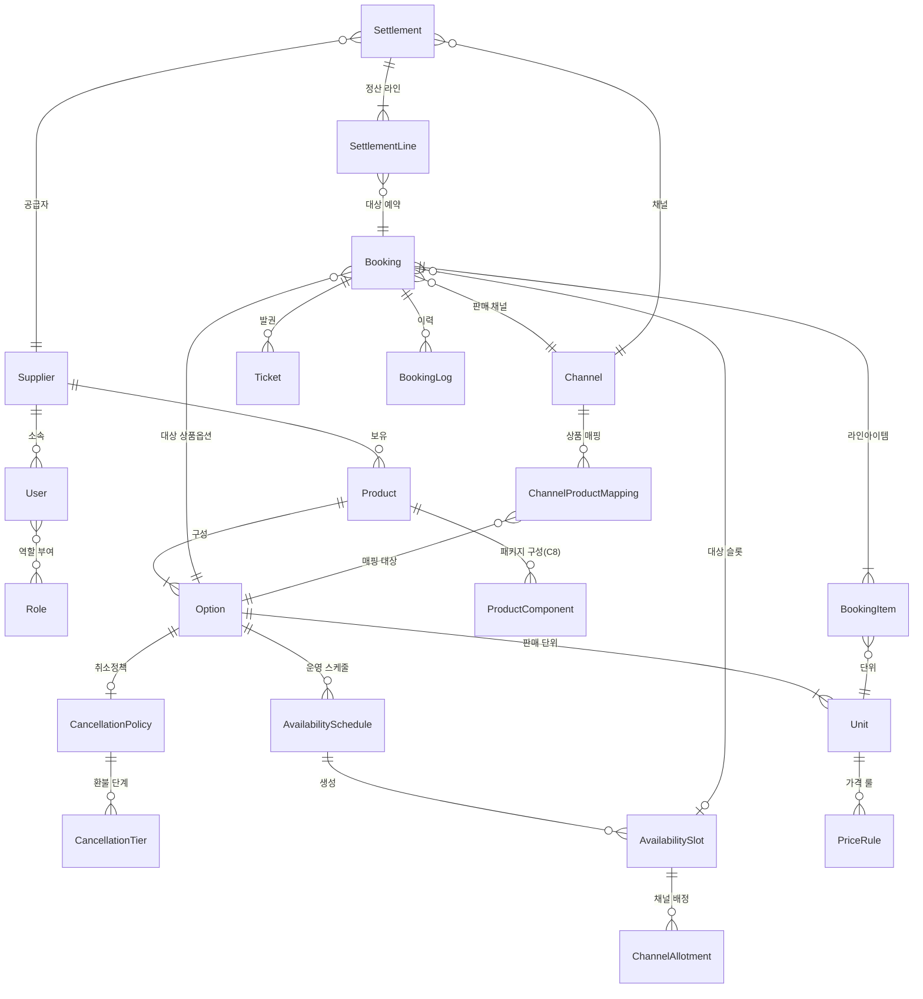
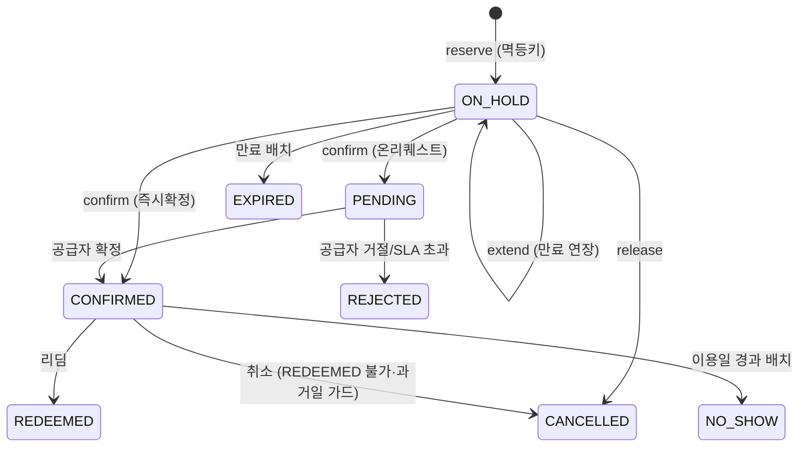

# 03. 도메인 모델 설계

> [02_카테고리별_관리모델_정의.md](02_카테고리별_관리모델_정의.md)의 요구사항을 데이터 모델로 구체화한다. 업계 표준(OCTO Product→Option→Unit)을 기반으로 하되, 채널 연동·정산까지 포괄한다.

---

## 1. 전체 ERD 개요

---

## 2. 엔터티 정의

### 2.1 조직/사용자

#### `Supplier` (공급자)
| 필드 | 타입 | 설명 |
|---|---|---|
| id | UUID | PK |
| name / legal_name | string | 상호 / 법인명 |
| business_reg_no | string | 사업자등록번호 |
| status | enum | `PENDING_REVIEW` / `APPROVED` / `SUSPENDED` / `REJECTED` — 가입 심사 워크플로 |
| default_currency | string(3) | 기준 통화 (ISO 4217) |
| timezone | string | 기준 타임존 (IANA, 예: Asia/Seoul) |
| contact_email / phone | string | 대표 연락처 |
| settlement_bank_info | json | 정산 계좌 (암호화 저장) |
| licenses | json | 여행업 등록증 등 카테고리별 판매자격 증빙 |

#### `User` (사용자)
| 필드 | 타입 | 설명 |
|---|---|---|
| id | UUID | PK |
| supplier_id | FK, nullable | 소속 공급자 (플랫폼 어드민은 null) |
| email / password_hash | string | 로그인 자격 (이메일 인증) |
| name / phone | string | |
| status | enum | `ACTIVE` / `INVITED` / `DISABLED` |
| last_login_at | datetime | |

#### `Role` / `UserRole` (역할·권한)
- 역할: `PLATFORM_ADMIN`(플랫폼 운영자), `SUPPLIER_OWNER`(공급자 관리자), `SUPPLIER_MANAGER`(운영자), `SUPPLIER_STAFF`(현장직원 — 리딤·예약조회만)
- 권한은 역할×리소스×액션 매트릭스 ([04_시스템_아키텍처_설계.md](04_시스템_아키텍처_설계.md) §3.1)
- **멀티테넌시**: 모든 공급자 데이터는 `supplier_id`로 격리. 쿼리 레벨 강제(tenant guard)

### 2.2 상품

#### `Product` (상품)
| 필드 | 타입 | 설명 |
|---|---|---|
| id | UUID | PK |
| supplier_id | FK | 소유 공급자 |
| category | enum | C1~C8 표준 카테고리 |
| sub_category | string | 세부 분류 (테마파크, 데이트립 등) |
| title / internal_name | string | 노출명 / 내부 관리명 |
| description | json | 계층형 설명: brief / highlights / full / purchase_notice / terms (KKday 콘텐츠 구조 준용) |
| media | json | 이미지 목록 (가로형, 최대 10장 권장) |
| destination | json | 국가/도시/좌표 |
| timezone | string | 상품 운영 타임존 (목적지 기준) |
| availability_type | enum | `START_TIME` / `OPENING_HOURS` / `FREESALE` |
| confirmation_type | enum | `INSTANT` / `ON_REQUEST` |
| confirmation_sla_hours | int | 온리퀘스트 확정 SLA (기본 24) |
| voucher_scope | enum | `PER_BOOKING`(예약당 1장) / `PER_PARTICIPANT`(인원당) |
| delivery_formats | enum[] | `QR_CODE` / `CODE128` / `PDF` / `TEXT` |
| redemption_mode | enum | `SINGLE`(1회) / `MULTI`(패스형 복수) / `PARTIAL`(부분) |
| validity_rule | json, nullable | 오픈데이트형 유효기간: `{basis: PURCHASE\|FIRST_USE, days: N}` |
| booking_fields | json | **카테고리별 동적 예약 필수필드 스키마** (항공편명, 기기정보 등) |
| status | enum | `DRAFT` / `IN_REVIEW` / `ACTIVE` / `PAUSED` / `ARCHIVED` |

#### `Option` (옵션/패키지)
| 필드 | 타입 | 설명 |
|---|---|---|
| id | UUID | PK |
| product_id | FK | |
| title | string | 옵션명 (예: "오전 출발 한국어 투어", "1일권") |
| language | string, nullable | 진행 언어 (투어) |
| duration_minutes | int, nullable | 소요시간 |
| meeting_point / pickup_available | json / bool | 미팅포인트, 픽업 여부·픽업 지점 목록 |
| local_start_times | time[], nullable | START_TIME형 세션 시각 목록 (예: 09:00, 14:00) |
| sale_period | daterange | 판매 기간 |
| cutoff_minutes | int | 판매 마감 (시작/방문일 기준 N분 전) |
| min_units / max_units | int | 예약당 최소/최대 수량 (최소 출발 인원 포함) |
| cancellation_policy_id | FK | 취소정책 |
| price_model | enum | `PER_UNIT`(단위당) / `PER_GROUP`(그룹·차량당 정액) |
| status | enum | `ACTIVE` / `PAUSED` |

#### `Unit` (판매 단위)
| 필드 | 타입 | 설명 |
|---|---|---|
| id | UUID | PK |
| option_id | FK | |
| type | enum | `ADULT` / `CHILD` / `YOUTH` / `INFANT` / `SENIOR` / `STUDENT` / `GROUP` / `OTHER` |
| sale_unit_type | enum | `PERSON` / `GROUP` / `VEHICLE` / `ROOM` / `DAY` / `PIECE` — 판매 단위 다양성 흡수 |
| pax_count | int | 단위당 인원 수 (그룹/차량 티켓 표현, 기본 1) |
| age_from / age_to | int, nullable | 연령 제한 |
| min_quantity / max_quantity | int | 단위별 수량 제한 |
| accompanied_by | FK[], nullable | 동반 필수 Unit (유아→성인) |
| booking_category | enum | `STANDARD` / `FREE_NO_TICKET` / `FREE_TICKET_REQUIRED` (GYG 준용) |
| restrictions | json | 신장·체중 등 (C3 액티비티) |

#### `PriceRule` (가격 룰)
| 필드 | 타입 | 설명 |
|---|---|---|
| id | UUID | PK |
| unit_id | FK | 대상 Unit (PER_GROUP 모델은 option 레벨 룰) |
| channel_id | FK, nullable | null = 기본가, 지정 시 채널 전용가 |
| date_range | daterange, nullable | 시즌 적용 기간 (null = 상시) |
| days_of_week | int[], nullable | 요일 제한 (주말가 등) |
| tier_min / tier_max | int, nullable | 인원 구간 (계단 가격) |
| original_price | decimal | 정가 (RRP) |
| retail_price | decimal | 판매가 |
| net_price | decimal | 공급가 (채널 정산 기준) |
| currency | string(3) | |
| included_taxes | json | 포함 세금 내역 |
| priority | int | 룰 충돌 시 우선순위 (특정일 > 요일 > 시즌 > 기본) |

#### `CancellationPolicy` / `CancellationTier`
| 필드 | 타입 | 설명 |
|---|---|---|
| policy.type | enum | `FREE`(기한 내 전액) / `NON_REFUNDABLE` / `TIERED` |
| policy.weather_full_refund | bool | 기상 취소 전액 환불 여부 (C3) |
| tier.hours_before | int | 이용 시작 N시간 전까지 |
| tier.refund_rate | decimal | 환불율 (1.0 / 0.5 / 0) |

정책은 공급자 단위로 재사용 (여러 Option이 동일 정책 참조).

#### `ProductComponent` (패키지 구성 — C8, Phase 2+)
| 필드 | 타입 | 설명 |
|---|---|---|
| package_product_id | FK | 패키지 상품 |
| component_option_id | FK | 구성 옵션 |
| selection_group / min_select / max_select | string / int | 선택형 패스: 그룹 내 N개 중 M개 선택 |
| partial_cancellable | bool | 구성별 부분 취소 허용 |

### 2.3 재고

#### `AvailabilitySchedule` (운영 스케줄 템플릿)
| 필드 | 타입 | 설명 |
|---|---|---|
| id | UUID | PK |
| option_id | FK | |
| date_range | daterange | 적용 기간 (시즌별 템플릿) |
| days_of_week | int[] | 운영 요일 |
| start_times | time[], nullable | 세션 시각 (START_TIME형) |
| capacity | int, nullable | 기본 정원 (null = 무제한/FREESALE) |
| capacity_by_unit | json, nullable | Unit별 분리 정원 (성인석/아동석) |

배치가 스케줄로부터 `AvailabilitySlot`을 미리 생성(rolling 365일). 스케줄 변경 시 **미래 슬롯 중 예약 없는 것만** 재생성.

#### `AvailabilitySlot` (재고 슬롯 — 재고의 단일 진실 원천)
| 필드 | 타입 | 설명 |
|---|---|---|
| id | UUID | PK |
| option_id | FK | |
| local_date | date | 이용일 |
| local_start_time | time, nullable | 세션 시각 (OPENING_HOURS/FREESALE형은 null) |
| capacity | int, nullable | 정원 (null = 무제한) |
| booked_count | int | 확정 수량 |
| held_count | int | 유효 홀드 수량 |
| status | enum | `OPEN` / `CLOSED`(블록아웃) / `SOLD_OUT` |
| version | int | **낙관적 잠금**용 (동시성 제어) |

- **잔여(vacancy) = capacity − booked_count − held_count** (파생값, 저장하지 않고 계산)
- FREESALE형 상품은 슬롯 없이 판매 가능(`availability_required = false`)하되, 총량 관리 시 가상 슬롯 1개(무일자) 사용

#### `ChannelAllotment` (채널 배정 — 선택 기능)
| 필드 | 타입 | 설명 |
|---|---|---|
| slot_id / channel_id | FK | |
| allotted / used | int | 배정 수량 / 사용 수량 |

기본은 공유재고(allotment 없음 = 전 채널 공용 풀). 특정 채널 보장 수량 필요 시만 생성.

### 2.4 예약/판매

#### `Booking` (예약)
| 필드 | 타입 | 설명 |
|---|---|---|
| id | UUID | PK |
| booking_no | string | 사람이 읽는 예약번호 (채널 노출용, ≤25자) |
| supplier_id / product_id / option_id | FK | 비정규화 포함 (조회 성능·이력 보존) |
| slot_id | FK, nullable | 오픈데이트형은 null |
| channel_id | FK | 판매 채널 (직판 포함) |
| channel_booking_ref | string | 채널 측 예약번호 |
| idempotency_key | UUID | **멱등키** (채널 재시도 중복 방지, unique) |
| status | enum | `ON_HOLD` / `PENDING` / `CONFIRMED` / `REJECTED` / `EXPIRED` / `CANCELLED` / `REDEEMED` / `NO_SHOW` |
| hold_expires_at | datetime, nullable | 홀드 만료 시각 |
| confirm_due_at | datetime, nullable | 온리퀘스트 확정 SLA 기한 |
| customer | json | 대표 예약자 (이름/이메일/전화/언어) |
| travelers | json[] | 참가자 목록 |
| booking_field_values | json | 동적 필드 응답값 (항공편명 등) |
| total_retail / total_net | decimal | 판매가/공급가 합계 (예약 시점 스냅샷) |
| currency | string(3) | |
| price_snapshot | json | 적용된 PriceRule 스냅샷 (가격 분쟁 대비) |
| cancellation | json, nullable | 취소 시각/사유/환불액/적용 tier |
| service_date | date | 이용일 (정산·노쇼 배치 기준) |

#### `BookingItem` (라인아이템)
| 필드 | 타입 | 설명 |
|---|---|---|
| booking_id / unit_id | FK | |
| quantity | int | 수량 |
| unit_retail / unit_net | decimal | 단가 스냅샷 |
| addon_items | json | Add-on (장비, 식사 등) |

#### `Ticket` (티켓/바우처)
| 필드 | 타입 | 설명 |
|---|---|---|
| id | UUID | PK |
| booking_id | FK | |
| booking_item_id | FK, nullable | PER_PARTICIPANT 발권 시 |
| code | string | 티켓 코드 (unique, 추측 불가 난수) |
| code_format | enum | `QR_CODE` / `CODE128` / `PDF` / `TEXT` |
| status | enum | `ISSUED` / `REDEEMED` / `VOID` |
| redeemed_at / redeemed_by | datetime / FK | 리딤 시각 / 처리 사용자 |
| redemption_log | json[] | 패스형 복수 리딤 이력 (시설별) |

#### `BookingLog` (감사 이력)
| 필드 | 타입 | 설명 |
|---|---|---|
| booking_id | FK | |
| event | enum | 상태 전이·수정·재발권 등 |
| before / after | json | 변경 전후 |
| actor_type / actor_id | enum / FK | `USER` / `CHANNEL_API` / `SYSTEM_BATCH` |
| created_at | datetime | |

### 2.5 채널/정산

#### `Channel` (판매 채널)
| 필드 | 타입 | 설명 |
|---|---|---|
| id | UUID | PK |
| code | string | `DIRECT`(직판) / `KLOOK` / `KKDAY` / `GYG` / `TRIP` / ... |
| integration_mode | enum | `PULL_API`(채널이 우리 API 호출 — OCTO) / `PUSH_ADAPTER`(우리가 채널 API 호출) / `MANUAL`(수기) |
| api_credentials | json | 채널별 인증 정보 (암호화) |
| commission_rate | decimal | 기본 커미션율 (공급자×채널 계약으로 오버라이드 가능) |
| currency | string(3) | 채널 정산 통화 |

#### `ChannelProductMapping` (채널 상품 매핑)
| 필드 | 타입 | 설명 |
|---|---|---|
| channel_id / option_id | FK | |
| external_product_id / external_option_id | string | 채널 측 상품/패키지 ID (KKday prod_no+pkg_no, GYG gygTourOptionId) |
| sync_status | enum | `LINKED` / `SYNC_ERROR` / `PAUSED` / `DEACTIVATED_BY_CHANNEL` |
| last_synced_at | datetime | |

#### `Settlement` / `SettlementLine` (정산)
| 필드 | 타입 | 설명 |
|---|---|---|
| settlement.supplier_id / channel_id | FK | |
| settlement.period | daterange | 정산 대상 월 |
| settlement.status | enum | `DRAFT` / `CONFIRMED` / `PAID` |
| settlement.total_gross / total_commission / total_payable | decimal | 총판매액 / 커미션 / 지급액 |
| line.booking_id | FK | 대상 예약 (완료분: REDEEMED·NO_SHOW·이용일 경과 CONFIRMED) |
| line.gross / commission / payable | decimal | 라인 금액 |
| line.adjustment | json, nullable | 취소 환불·조정 내역 |

---

## 3. 예약 상태머신 및 재고 정합성

### 3.1 상태 전이 (허용 전이만)

전이별 가드 조건:
- `confirm`: 홀드 미만료 + 가격 스냅샷 일치
- `cancel`: 상태가 CONFIRMED/PENDING/ON_HOLD 일 때만. REDEEMED·이용일 경과 예약은 거부 (GYG `BOOKING_REDEEMED`/`BOOKING_IN_PAST` 준용)
- `redeem`: CONFIRMED만. 부분 리딤은 Ticket 단위로 처리, 전 티켓 리딤 시 Booking을 REDEEMED로

### 3.2 재고 정합성 원칙

1. **원자적 차감**: 홀드 생성 시 `UPDATE availability_slot SET held_count = held_count + :q WHERE id = :id AND (capacity IS NULL OR capacity - booked_count - held_count >= :q)` — 조건부 갱신으로 오버부킹 원천 차단 (affected rows = 0 이면 `NO_AVAILABILITY` 반환)
2. **홀드 → 확정 전환**: `held_count − q, booked_count + q` 를 단일 트랜잭션으로
3. **홀드 만료**: 배치(1분 주기)가 `hold_expires_at < now()` 예약을 EXPIRED 처리 + `held_count` 복원
4. **취소 복원**: CANCELLED 전이 시 `booked_count` 복원 → 채널에 재고 재개 push
5. **멱등성**: 채널 재시도 시 `idempotency_key` unique 제약으로 기존 예약 반환 (이중 차감 방지)
6. **패키지(C8)**: 구성 슬롯 전체를 단일 트랜잭션에서 차감, 하나라도 실패 시 전체 롤백
7. **매진/재개 이벤트**: `vacancy == 0` 도달·해제 시 도메인 이벤트 발행 → 채널 동기화 모듈이 구독 (→ [05_채널연동_API_설계.md](05_채널연동_API_설계.md))

### 3.3 시간 처리 원칙

- 모든 저장은 UTC + 상품 타임존 병기. `local_date`/`local_start_time`은 **상품 타임존 기준** (OTA 관행: 목적지 기준)
- 컷오프·취소 tier 계산은 상품 타임존의 이용 시작 시각 기준
- 정산 기간 산정은 공급자 타임존 기준
