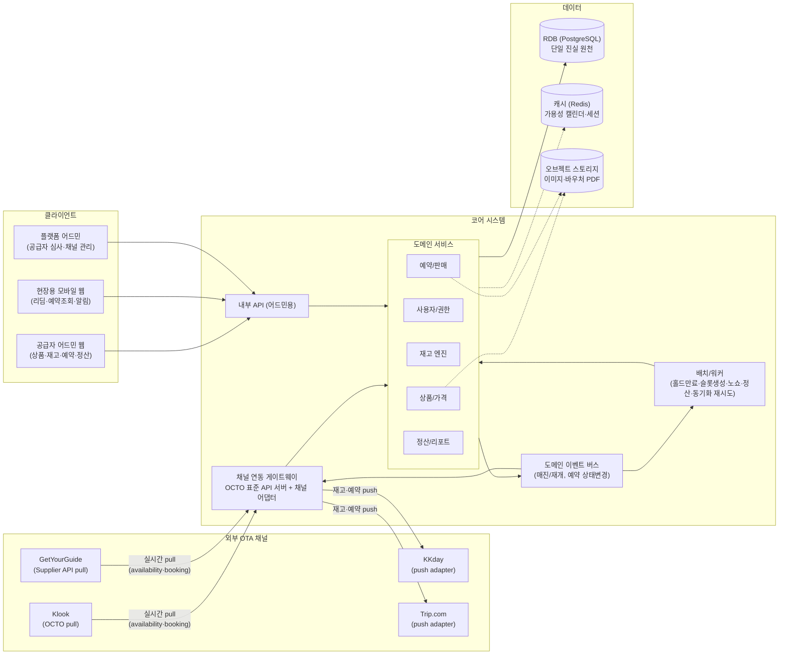

# 04. 시스템 아키텍처 설계

> 공급자 판매관리 시스템의 전체 구성, 5개 모듈의 기능 명세, 기술 스택 권고안을 정의한다.

---

## 1. 전체 구성도

### 아키텍처 원칙

1. **모듈러 모놀리스로 시작**: 도메인 서비스 5개를 모듈 경계가 명확한 단일 애플리케이션으로 구성. 초기 팀 규모에서 마이크로서비스 오버헤드 회피. 채널 게이트웨이만 별도 배포 단위 고려(외부 노출·가용성 요구가 다름)
2. **재고의 단일 진실 원천 = RDB**: 가용성 계산은 DB 조건부 갱신으로 정합성 보장, 캐시는 조회 가속용(캘린더 뷰)으로만
3. **이벤트 기반 채널 동기화**: 재고 변경·예약 상태 변경을 도메인 이벤트로 발행, 게이트웨이가 구독하여 채널 push/webhook 전송 — 코어 로직과 채널별 구현 분리
4. **채널 어댑터 패턴**: 채널마다 `ChannelAdapter` 인터페이스(재고 push, 예약 수신 변환, 상품 매핑) 구현체를 플러그인으로 추가 — 채널 추가 시 코어 무변경

---

## 2. 모듈별 기능 명세

### 2.1 사용자/권한 모듈

| 기능 | 상세 |
|---|---|
| 공급자 가입 | 셀프 가입 신청(사업자 정보·증빙 업로드) → 플랫폼 어드민 심사 → 승인/반려. 승인 시 SUPPLIER_OWNER 계정 활성화 |
| 사용자 관리 | 공급자 내 사용자 초대(이메일), 역할 부여/회수, 비활성화 |
| 인증 | 이메일+비밀번호, 이메일 인증, 비밀번호 재설정, 세션/토큰(JWT) 관리, (확장) 2FA |
| 멀티테넌시 | 모든 요청에 tenant guard — supplier_id 스코프 강제. 플랫폼 어드민만 크로스 테넌트 |
| 감사 | 로그인 이력, 권한 변경 이력 |

#### 권한 매트릭스 (요약)

| 리소스 \ 역할 | PLATFORM_ADMIN | SUPPLIER_OWNER | SUPPLIER_MANAGER | SUPPLIER_STAFF |
|---|---|---|---|---|
| 공급자 심사/채널 설정 | CRUD | — | — | — |
| 사용자/역할 관리 | 전체 | 자사 | — | — |
| 상품/가격/재고 | 조회 | CRUD | CRUD | 조회 |
| 예약 (확정/취소/수정) | 조회 | 전체 | 전체 | 조회 |
| 리딤 | — | ✓ | ✓ | ✓ |
| 정산 | 전체 | 자사 조회/확정 | 조회 | — |

### 2.2 상품/재고 관리 모듈

| 기능 | 상세 |
|---|---|
| 상품 등록 | 카테고리(C1~C8) 선택 → **카테고리별 동적 속성 폼**(유효기간·좌석등급·차량등급 등) → 콘텐츠(계층형 설명·이미지) → 심사(선택) → 게시. 상태: DRAFT→IN_REVIEW→ACTIVE |
| 옵션/유닛 구성 | 옵션(언어·시간·코스) 및 유닛(성인/아동/그룹, 판매단위, 연령·수량 제약, 동반 조건) 편집 |
| 취소정책 관리 | 정책 3유형 CRUD, 공급자 단위 재사용, 옵션에 연결 |
| 가격 관리 | PriceRule CRUD: 기본가 → 시즌/요일 오버라이드 → 채널별 가격(고정가/할인율) → 인원구간 계단가. **가격 캘린더 뷰**(월 달력에 일자별 적용가 표시) |
| 스케줄/재고 관리 | 운영 스케줄 템플릿(기간×요일×세션×정원) → 슬롯 자동 생성(rolling 365일). **재고 캘린더 뷰**: 일자/세션별 정원·판매·잔여 표시, 인라인 수정(정원 변경·블록아웃·세션 추가/마감) |
| 대량 작업 | 기간 일괄 블록아웃, 기간 일괄 정원 변경, 가격 일괄 조정 |
| 프로모션 | 딜(early bird/last minute) 기간·할인율·한도 설정 |

### 2.3 예약/판매 관리 모듈

| 기능 | 상세 |
|---|---|
| 예약 목록/검색 | 상태·채널·상품·이용일·예약일 필터, 키워드(예약번호/고객명) 검색 |
| 예약 상세 | 고객·참가자·동적 필드·가격 스냅샷·티켓·이력 타임라인 |
| 수동 확정 | PENDING 큐(확정 대기 목록) + SLA 카운트다운 표시, 확정/거절(사유) 액션, 신규 예약 알림(이메일/푸시) |
| 예약 수정 | 날짜·세션 변경(재고 재검증), 인원 변경(차액 계산), 참가자 정보 수정. 채널 예약은 채널 정책에 따라 수정 가능 범위 제한 |
| 취소/환불 | 취소정책 자동 적용 환불액 계산 → 확인 → 처리. 공급자 사유 취소(전액 환불 + 채널 통보) 별도 액션 |
| 바우처/티켓 | 확정 시 자동 발권(코드 생성·QR 렌더링·PDF), 재발권(기존 VOID), 발송(이메일) |
| 리딤 | 현장용 모바일 화면: QR 스캔/코드 입력 → 예약 검증(상태·이용일) → 사용 처리. 부분 리딤, 패스형 복수 리딤 |
| 예약 캘린더 | 일/주 단위 세션별 예약 현황(투어 명단 뷰 포함), 명단 인쇄/내보내기 |
| 수기 예약 | 어드민에서 직판/전화 예약 직접 등록 (DIRECT 채널) |
| 배치 | 홀드 만료(1분), 노쇼 전환(일 1회), SLA 임박 알림 |

### 2.4 채널 연동 모듈

상세 API 명세는 [05_채널연동_API_설계.md](05_채널연동_API_설계.md) 참조.

| 기능 | 상세 |
|---|---|
| OCTO API 서버 | Klook 등 pull형 채널에 제공하는 표준 API (products / availability / bookings) + API 키 발급·관리 |
| 채널 어댑터 | push형 채널(KKday 등)별 어댑터: 재고 push, 상품정보 push, 예약 수신 웹훅 처리 |
| 상품 매핑 | 자사 옵션 ↔ 채널 상품ID 매핑 화면 (Supply: 신규 push 등록 / Connect: 기존 채널 상품 연결) |
| 동기화 모니터링 | 채널별 동기화 상태·실패 큐·재시도, 채널의 상품 비활성화 통보(GYG PRODUCT_DEACTIVATION) 수신·알림·복구 액션 |
| 채널 설정 | 채널별 커미션율, 가격 방식(고정가/할인율), 통화, allotment 설정 |

### 2.5 정산/리포트 모듈

| 기능 | 상세 |
|---|---|
| 정산 생성 | 월 배치: 완료 예약(REDEEMED / NO_SHOW / 이용일 경과 CONFIRMED) 집계 → 채널별 커미션 공제 → Settlement DRAFT 생성 |
| 정산 확정 | 공급자 검토 → 확정 → 지급 처리 기록. 조정(취소 소급·클레임) 라인 추가 |
| 판매 리포트 | 기간별·채널별·상품별 판매액/예약수/취소율, 리드타임(예약일→이용일) 분석, CSV 내보내기 |
| 대시보드 | 오늘의 예약/이용/확정 대기, 매출 추이, 채널 비중 |

---

## 3. 기술 스택 권고안 (후보 제시)

> 확정이 아닌 권고안. 팀 역량에 따라 조정.

| 레이어 | 권고 | 근거 |
|---|---|---|
| 백엔드 | **TypeScript + NestJS** (대안: Kotlin + Spring Boot) | 모듈러 모놀리스 구조화 용이, 프론트와 언어 통일, OCTO가 JSON/REST 표준 |
| DB | **PostgreSQL** | 조건부 갱신·트랜잭션 기반 재고 정합성, jsonb(동적 필드·스냅샷), daterange 타입 |
| 캐시/큐 | **Redis** (+BullMQ 등 잡 큐) | 가용성 캘린더 캐시, 배치·동기화 재시도 큐 |
| 프론트 | **React (Next.js)** | 어드민 웹 + 현장용 모바일 웹(반응형·PWA)을 단일 스택으로 |
| 인프라 | 클라우드 매니지드 (AWS/GCP), 컨테이너 기반 | 초기 단일 리전, 게이트웨이 분리 배포 옵션 |
| 관측 | 구조화 로깅 + APM + 채널 API 호출 감사 로그 | 채널 연동 장애 진단(오버부킹·비활성화 예방)이 사업 크리티컬 |

---

## 4. 비기능 요구사항

| 항목 | 요구 |
|---|---|
| 가용성 | 채널 게이트웨이(availability/booking API)는 OTA SLA 대상 — 응답 실패 반복 시 채널이 상품을 자동 비활성화(GYG 사례). 게이트웨이 우선 이중화 |
| 성능 | availability 조회 p95 < 500ms (캐시 활용), 예약 생성 p95 < 2s. 채널 rate limit 고려(KKday 60 QPS 사례 참고) |
| 정합성 | 오버부킹 0 목표 — DB 조건부 갱신 + 멱등키. 가격은 예약 시점 스냅샷 보존 |
| 보안 | 테넌트 격리 강제, 정산 계좌·채널 자격증명 암호화, 티켓 코드 추측 불가 난수, 감사 로그 |
| 국제화 | 다통화(ISO 4217, 소수점 없는 통화 처리), 다국어 콘텐츠(초기 한/영), 타임존(상품별) |
