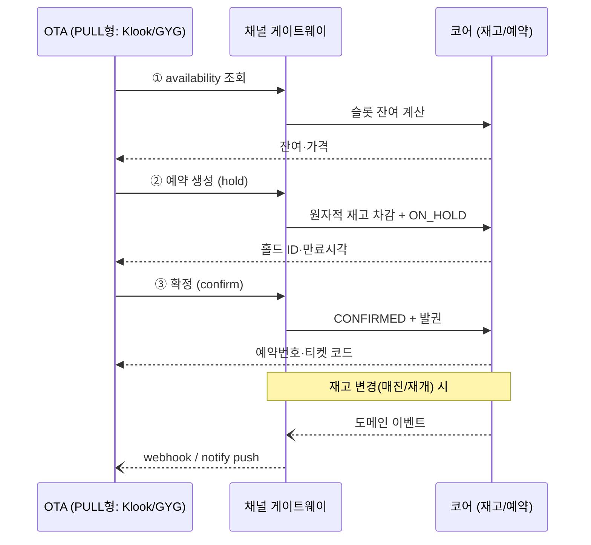
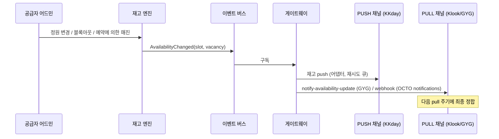

# 05. 채널 연동 API 설계

> OTA 채널과의 재고·예약 연동 설계. **OCTO(Open Connectivity for Tourism Operators) 표준**을 기준 스펙으로 채택한다 — Klook Open API가 OCTO 기반이며, Ventrata·Bókun 등 업계 채널매니저가 채택한 사실상 표준이다.

---

## 1. 연동 모델 개요

채널마다 연동 방향이 다르며, 시스템은 두 모델을 모두 지원한다:

| 모델 | 방향 | 해당 채널 | 구현 |
|---|---|---|---|
| **PULL** | 채널이 우리 API를 실시간 호출 (재고 조회·예약 생성) | Klook(OCTO), GetYourGuide(GYG Supplier API 스펙을 우리가 구현) | 채널 게이트웨이의 **API 서버** |
| **PUSH** | 우리가 채널 API를 호출 (재고·상품정보 push, 예약은 웹훅 수신) | KKday(채널매니저형), Trip.com | 채널별 **어댑터** |

---

## 2. OCTO 표준 API 서버 명세 (PULL형 채널 제공용)

### 2.1 공통 사항

| 항목 | 정의 |
|---|---|
| 프로토콜 | REST / JSON, HTTPS 필수 |
| 인증 | 채널별 API 키 (Bearer). 키 단위로 접근 가능 공급자·상품 스코프 제한 |
| Capability | `Octo-Capabilities` 헤더로 확장 기능 협상: `octo/pricing`, `octo/content`, `octo/notifications` |
| 멱등성 | 예약 생성 시 클라이언트 제공 `uuid`를 멱등키로 — 재시도 시 기존 예약 반환 |
| Rate limit | 키별 제한 (예: 60 QPS), 초과 시 `429` |
| 오류 | 표준 오류 코드: `NO_AVAILABILITY` / `INVALID_UNIT` / `INVALID_BOOKING_STATE` / `BOOKING_REDEEMED` / `BOOKING_IN_PAST` 등 |

### 2.2 엔드포인트 목록

#### Products (상품)

| 엔드포인트 | 기능 |
|---|---|
| `GET /suppliers/{id}` | 공급자 정보 |
| `GET /products` | 상품 목록 (Product→Option→Unit 전체 구조) |
| `GET /products/{id}` | 상품 상세 |

응답 핵심 필드 (도메인 모델 매핑):

| OCTO 필드 | 자사 모델 |
|---|---|
| `availabilityType` (START_TIME / OPENING_HOURS) | `Product.availability_type` (FREESALE은 `allowFreesale=true` + `availabilityRequired=false`로 표현) |
| `instantConfirmation` | `confirmation_type == INSTANT` |
| `deliveryMethods` (TICKET / VOUCHER) | `voucher_scope` (PER_PARTICIPANT / PER_BOOKING) |
| `deliveryFormats` (QRCODE / CODE128 / PDF_URL) | `delivery_formats` |
| `options[].availabilityLocalStartTimes` | `Option.local_start_times` |
| `options[].cancellationCutoff` | `Option.cutoff_minutes` |
| `options[].units[]` (type, restrictions, paxCount) | `Unit` |
| `options[].requiredContactFields` + questions | `Product.booking_fields` (동적 필드) |

#### Availability (가용성) — 2단계 조회

| 엔드포인트 | 용도 | 응답 |
|---|---|---|
| `POST /availability/calendar` | 달력용 대량 조회 (날짜 범위) | 일 단위: `{localDate, status, vacancies, capacity, openingHours}` |
| `POST /availability/check` | 예약 직전 슬롯 확인, **availabilityId 발급** | 슬롯 단위: `{id, localDateTimeStart/End, utcCutoffAt, vacancies, capacity, status}` |

- `status` enum: `AVAILABLE` / `FREESALE` / `LIMITED`(잔여 50% 미만) / `SOLD_OUT` / `CLOSED`
- 요청에 `units[{id, quantity}]` 포함 시 조합 가능 여부 검증
- `availabilityId` = 슬롯 식별자 (예약 생성의 필수 선행값)
- 구현: calendar는 Redis 캐시(슬롯 변경 시 무효화), check는 DB 실시간

#### Bookings (예약) — 2단계 커밋

| 엔드포인트 | 기능 | 상태 전이 |
|---|---|---|
| `POST /bookings` | 홀드 생성. req: `{uuid(멱등키), productId, optionId, availabilityId, unitItems[{unitId}], expirationMinutes}` | → `ON_HOLD` (만료시각 응답) |
| `POST /bookings/{uuid}/extend` | 홀드 연장 | `ON_HOLD` 유지 |
| `POST /bookings/{uuid}/confirm` | 확정. req: 연락처·resellerReference·동적 필드 응답 | → `CONFIRMED` (즉시확정) 또는 `PENDING` (온리퀘스트) |
| `PATCH /bookings/{uuid}` | 예약 변경 (일자·인원 — 재고 재검증) | 상태 유지 |
| `POST /bookings/{uuid}/cancel` | 취소 (REDEEMED·과거 이용일 거부) | → `CANCELLED` |
| `GET /bookings` / `GET /bookings/{uuid}` | 조회 | — |

- confirm 응답에 `deliveryOptions[{deliveryFormat, deliveryValue}]` — 티켓 바코드 데이터/PDF URL 전달
- 온리퀘스트 상품: confirm 응답 status = `PENDING`, 공급자 확정/거절 시 webhook 통보 (`octo/notifications`)

#### Capabilities (확장)

| Capability | 내용 |
|---|---|
| `octo/pricing` | availability·booking 응답에 가격 포함: `{original, retail, net, currency, includedTaxes}`. 채널별 net가 적용 |
| `octo/content` | 상품 리치 콘텐츠(제목·설명·이미지·미팅포인트) — 채널 상품 자동 등록용 |
| `octo/notifications` | 채널이 webhook 구독: 가용성 변경(매진/재개), 예약 상태 변경(PENDING→CONFIRMED/REJECTED), 상품 변경 |

### 2.3 리딤 통보 (채널 방향)

채널이 정산·CS를 위해 사용 여부를 요구하는 경우 (GYG redeem API 준용):
- 자사에서 리딤 발생 시 → 채널로 `redeem` 통보 push (어댑터 경유)

---

## 3. 채널별 연동 방식 매핑

| 채널 | 모델 | 연동 방식 | 특이사항 |
|---|---|---|---|
| **Klook** | PULL | Klook이 우리 OCTO API 호출: Availability Check(availabilityId) → Reserve → Confirm. `octo/pricing`으로 Original/Retail/Net 3중가 제공 | OCTO 표준 그대로 — 기준 구현. webhook capability는 Klook 로드맵(coming soon)이므로 초기엔 pull 주기 의존 |
| **GetYourGuide** | PULL | GYG Supplier API **스펙을 우리가 구현**: `get-availabilities` / `reserve` / `book` / `cancel-reservation` / `cancel-booking` + 실시간 변경은 GYG 호스팅 `notify-availability-update`로 push | Basic Auth. 가용성 pull 주기: 향후 7일치는 4시간마다 등. 오류 반복 시 `PRODUCT_DEACTIVATION` 통보 수신 → 알림·복구(activate) 플로 필수. 가격은 retail가 + 커미션 공제 모델 |
| **KKday** | PUSH | 어댑터가 KKday 측 API/채널매니저 규격으로: 상품정보 push(Renew Product Info), 세션·재고 push(Sync Availability), 예약 수신 | 공급자 인바운드 API는 비공개 — 파트너 계약 후 스펙 수령 전제. 매핑 2방식: Supply(신규 등록) / Connect(기존 상품 연결, prod_no+pkg_no). 채널 가격: 고정가 vs 할인율 |
| **Trip.com** | PUSH | 어댑터. Vendor Platform(vbooking) 연동 규격은 파트너 계약 후 확정 | Bókun 등 채널매니저 경유 옵션도 검토 가능 |
| **직판(DIRECT)** | 내부 | 어드민 수기 예약 → 동일 예약 파이프라인 (channel = DIRECT, 커미션 0) | |

---

## 4. 동기화 시나리오

### 4.1 재고 변경 전파 (매진·재개·블록아웃)

- push 실패는 재시도 큐(지수 백오프) + 실패 알림. **채널별 마지막 동기화 상태**를 매핑 테이블에 기록
- 이벤트는 슬롯 단위 디바운스(짧은 시간 내 다중 변경 병합)

### 4.2 온리퀘스트 확정 전파

1. 채널 예약 유입 → `PENDING` + 공급자 알림
2. 공급자 확정/거절 → 채널로 상태 통보 (webhook / 어댑터 push)
3. SLA(24–48h) 초과 임박 알림 → 초과 시 정책에 따라 자동 거절(전액 환불) 옵션

### 4.3 채널 상품 비활성화 대응 (GYG PRODUCT_DEACTIVATION 사례)

1. 채널로부터 비활성화 통보 수신 (오버부킹·오류 반복 시 채널이 자동 조치)
2. 매핑 상태 `DEACTIVATED_BY_CHANNEL` 기록 + 공급자·운영자 즉시 알림
3. 원인 진단 화면(최근 API 오류 로그) → 조치 후 재활성화 요청(activate) 액션

### 4.4 장애 시 안전장치

- 게이트웨이 다운 시: PULL 채널은 `NO_AVAILABILITY`가 아닌 5xx를 받아야 함 (매진 오인 방지)
- 코어-채널 간 예약 불일치 탐지: 일 배치로 채널 예약 목록 대사(reconciliation)
- 가격 불일치: 예약 시점 채널 제시가와 자사 계산가 불일치 시 예약 거부 + 알림 (silent 손실 방지)

---

## 5. 출처

- OCTO 표준: https://octo.travel/specification , https://docs.octo.travel/ (Products / Availability / Bookings / Capabilities)
- Klook Open API (OCTO 기반): https://klook.gitbook.io/openapi
- GYG Supplier API OpenAPI 스펙: https://integrator.getyourguide.com/assets/api_documentation/supplier-api-supplier-endpoints.yaml , https://integrator.getyourguide.com/documentation/overview
- KKday 채널 연동(rezio 문서): https://help.rezio.io/en/support/solutions/articles/67000636130
- Ventrata OCTO 구현 예: https://docs.ventrata.com/
