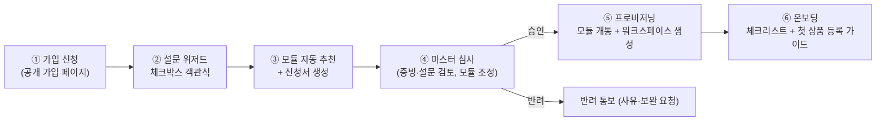
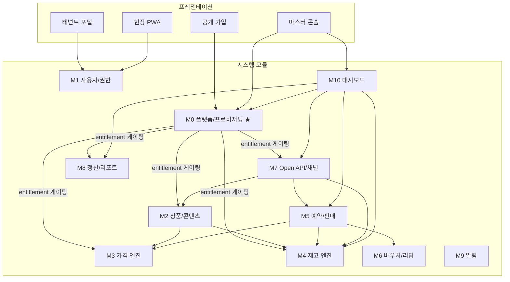
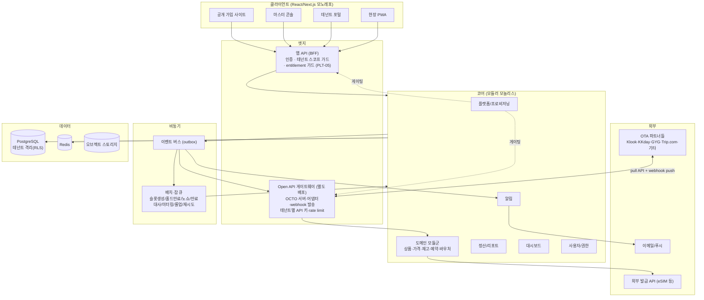
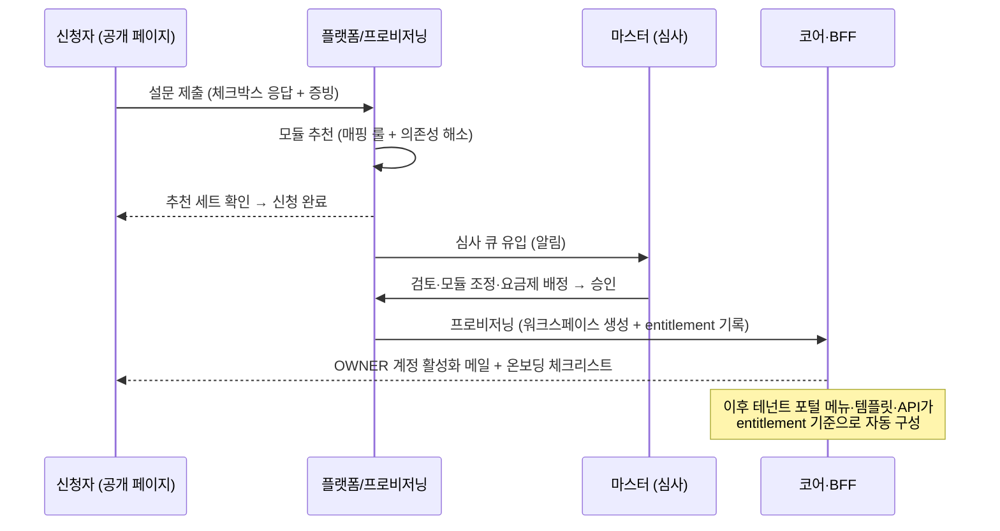
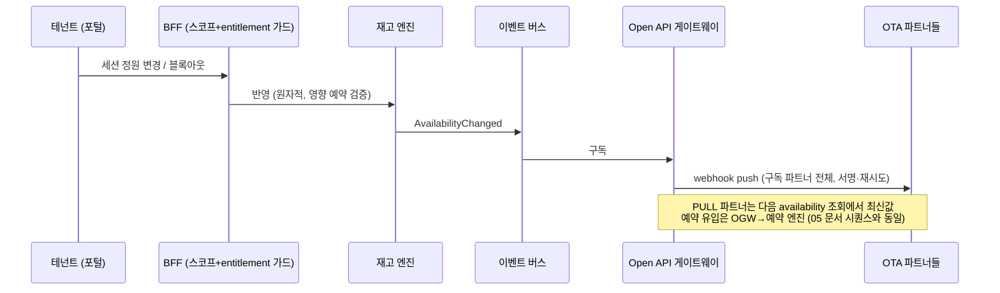

# 08. 시스템 기획서 — 투어&액티비티 판매관리 SaaS (모듈형 멀티테넌트)

> 본 기획서는 [07_상품_케이스별_관리로직_상세.md](07_상품_케이스별_관리로직_상세.md)의 실상품 23개 케이스와 관리 로직을 기반으로, 시스템의 **사용자·운영 구조, 모듈 체계, 가입·프로비저닝 절차, UI/UX 전략, 모듈 구성 및 기능 명세, 전체 아키텍처**를 정의한다.
> 선행 문서: [01 카테고리 분석](01_OTA_카테고리_분석.md) · [02 관리모델](02_카테고리별_관리모델_정의.md) · [03 도메인 모델](03_도메인_모델_설계.md) · [05 채널연동 API](05_채널연동_API_설계.md) · [06 로드맵](06_개발_로드맵.md)
> **개정 v3 (SaaS 재정의)**: 사용자 = 서로 다른 시설사·공급사(독립 테넌트). 당사는 **마스터 계정**으로 전 모듈을 보유하고, 가입 설문(체크박스)–승인 절차를 통해 테넌트별로 맞는 가격/재고 모듈을 개통(프로비저닝)하는 **모듈형 SaaS**. Open API 모듈로 OTA에 상품·가격·재고를 실시간 배포.

---

## 1. 개요

### 1.1 제품 정의

관리 형태가 전혀 다른 투어&액티비티 상품들을 다루는 **시설사(venue — 테마파크·공연장·전망대 등)와 공급사(supplier — 투어사·액티비티 운영사·렌탈사 등)** 에게, 각자의 상품 형태와 가격/재고 관리 방식에 **딱 맞는 모듈 조합만 개통해 주는 B2B SaaS 판매관리 플랫폼**.

```
당사(플랫폼) = 마스터 계정: 모든 모듈 보유 + 가입 심사 + 모듈 프로비저닝 + 플랫폼 운영
     │  개통(entitlement)
     ▼
테넌트 A (시설사: 테마파크)  → [시즌가격 + 시간대가격 + 무제한재고 + 한정수량 + Open API]
테넌트 B (시설사: 공연장)    → [좌석등급가격 + 회차재고 + Open API]
테넌트 C (공급사: 투어사)    → [세션재고 + 그룹가격 + 최소인원 + 명단운영]
테넌트 D (공급사: 렌탈사)    → [기간점유재고 + 일수산식가격 + 물류]
     │  Open API 모듈 (실시간 배포)
     ▼
OTA 채널: Klook · KKday · GetYourGuide · Trip.com · 기타 (OCTO 표준)
```

### 1.2 운영 모델 3원칙

1. **마스터는 모든 모듈을 보유, 테넌트는 필요한 모듈만**: 모듈 = 07 케이스에서 도출한 가격/재고/상품유형/연동 기능의 패키징 단위(§2). 테넌트 화면에는 개통된 모듈의 메뉴·필드·템플릿만 나타난다 — 테마파크에게 "좌석등급"이, 공연장에게 "렌탈 반납"이 보이지 않는다.
2. **가입은 셀프서비스 설문, 개통은 마스터 승인**: 가입 페이지에서 상품 형태·가격/재고 관리 방법을 **객관식(체크박스)** 으로 수집 → 시스템이 모듈 세트를 자동 추천 → 마스터가 심사·조정·승인 → 모듈 개통 (§3).
3. **Open API로 실시간 유통**: Open API 모듈을 개통한 테넌트의 상품·가격·재고는 OCTO 표준 API로 다수 OTA에 실시간 제공(pull)되고, 변경·매진은 즉시 push(webhook)된다. 채널 계약 주체는 테넌트이며 플랫폼은 연동 인프라를 제공한다.

### 1.3 사용자 재정의

| 구분 | 주체 | 계정·포털 | 하는 일 |
|---|---|---|---|
| **플랫폼 (당사)** | 마스터 계정 | **마스터 콘솔** | 가입 심사·모듈 프로비저닝, 전 테넌트 모니터링, 모듈 카탈로그·요금제 관리, Open API 게이트웨이 운영, 플랫폼 운영자(내부 직원) 관리 |
| **시설사** (venue) | 독립 테넌트 | **테넌트 포털** (개통 모듈만 노출) | 자기 시설 상품(입장권·공연·슬롯입장 등) 등록, 가격·재고 직접 관리, 예약·리딤 운영, 채널 유통, 정산 |
| **공급사** (supplier) | 독립 테넌트 | 테넌트 포털 (동일) | 투어·액티비티·트랜스퍼·렌탈 등 상품 운영 — 시설사와 동일 포털, 개통 모듈만 다름 |
| 현장 직원 | 테넌트 소속 | 현장 모바일(PWA) | 리딤·명단·긴급 마감 |

- 시설사/공급사는 **기능적으로 동일한 테넌트**이며, 차이는 가입 설문 결과에 따라 개통되는 모듈 조합뿐이다 (시설사 → 티켓·공연·슬롯 계열, 공급사 → 세션·그룹·렌탈 계열이 전형적).
- 테넌트 내 역할: `TENANT_OWNER`(관리자) / `TENANT_MANAGER`(운영) / `TENANT_FINANCE`(정산) / `TENANT_STAFF`(현장). 마스터 측 역할: `MASTER_ADMIN` / `MASTER_OPS`(심사·프로비저닝·지원) / `MASTER_ENGINEER`(연동·장애).
- 데이터는 테넌트 단위로 완전 격리(멀티테넌시). 마스터만 크로스 테넌트 조회(운영 지원 목적, 감사 로그 기록).

### 1.4 페르소나

| 페르소나 | 소속 | 주 화면 | 핵심 니즈 |
|---|---|---|---|
| 플랫폼 운영 담당 (MASTER_OPS) | 당사 | 마스터 콘솔: 가입 심사 큐, 테넌트 현황 | 설문 결과와 증빙만 보고 5분 내 모듈 세트 확정 |
| 테마파크 IT/영업 담당 | 시설사 | 가격·재고 캘린더, 채널 모니터 | 시즌가 개정과 채널 반영이 실수 없이 |
| 공연장 티켓 매니저 | 시설사 | 회차·등급 재고, 예약 보드 | 회차별 등급 잔여를 한눈에, 공연 취소 일괄 처리 |
| 투어사 대표 | 공급사 | 대시보드, 확정 대기 큐, 명단 | 오늘 출발 명단과 확정 대기 처리 |
| 렌탈사 운영자 | 공급사 | 재고 풀 히트맵, 반납 추적 | 기간 겹침 재고와 미반납 관리 |
| 현장 직원 | 테넌트 공통 | 모바일 스캔 | 3초 판정 |

---

## 2. 모듈 체계 (Module Catalog)

### 2.1 모듈 설계 원칙

- **모듈 = 기능 명세(§5)의 묶음 + 화면 노출 + 상품 템플릿 활성화**의 단위. 테넌트별 개통 여부(entitlement)로 제어.
- 모든 테넌트는 **코어 모듈**을 기본 포함하고, 그 위에 가격/재고/상품유형/연동/운영 모듈을 조합한다.
- 모듈 간 의존성 명시(예: `좌석등급 재고` ⇒ `회차(슬롯) 재고` 필요) — 프로비저닝 시 자동 해소.
- 요금제와 연결: 모듈 조합·상품 수·거래량이 SaaS 과금의 기준(§2.4).

### 2.2 모듈 카탈로그

#### 코어 (전 테넌트 기본)

| 모듈 코드 | 이름 | 포함 내용 |
|---|---|---|
| CORE | 코어 | 상품 3계층(Product/Option/Unit) 등록, 기본 단일가, 일자별 재고, 예약 상태머신·수기 예약, 바우처(QR/PDF)·리딤, 취소정책, 테넌트 대시보드, 사용자·역할 관리 |

#### 가격 모듈 (PRICE-*)

| 코드 | 이름 | 내용 | 근거 케이스 |
|---|---|---|---|
| PRICE-SEASON | 시즌/날짜별 가격 | 시즌 캘린더, 날짜 tier 체계+배정 캘린더, 요일별 가격 | T1, T3 |
| PRICE-TIMEBAND | 시간대별 가격 | 슬롯 시각 구간 가격(프라임아워), 시간대별 Option 가격 | T1, T6 |
| PRICE-CLASS | 등급별 가격 | 좌석/캐빈/차량 등급별 가격 (Option 등급 축) | S1, T8, TR1 |
| PRICE-GROUP | 그룹/대당 가격 | PER_GROUP 정액, 초과 인원 추가금, 인원 구간 계단가 | A2, X1 |
| PRICE-ZONE | 구간 요금표 | zone×차량 매트릭스, 심야 할증, 왕복 합산 | TR1 |
| PRICE-FORMULA | 산식 가격 | 일수 비례(렌탈), 연박 합산, 참조+증분 | E2, B2 |
| PRICE-PROMO | 프로모션 | early bird/last minute, 할인 한도, 구매시점 조건 | X1, T6 |
| PRICE-CHANNEL | 채널별 가격 | 채널별 고정가/할인율, 넷가, 통화 환산 (Open API 개통 시 권장) | 공통 |

#### 재고 모듈 (INV-*)

| 코드 | 이름 | 내용 | 근거 케이스 |
|---|---|---|---|
| INV-DATE | 일자별 재고 | (코어 포함) 일자별 수량·블록아웃 | T3 |
| INV-SLOT | 슬롯/세션 재고 | 회차·타임슬롯 스케줄, 세션 정원, 컷오프, 최소 인원 판정 | A1, S1, T5, T6 |
| INV-CLASS | 등급 재고 | 회차×좌석등급(zone) 분리 정원, Unit별 분리 정원 | S1, F2 |
| INV-OPEN | 무제한/오픈데이트 | FREESALE, 유효기간(구매일/첫사용/2단계), blackout·사용조건, 만료 배치 | T2, T7, TR3, F1 |
| INV-FLASH | 한정수량/온세일 | 일자별 한정 capacity, 온세일 시각, 구매수량 제한, 단축 홀드 | T4 |
| INV-RENTAL | 기간 점유 재고 | 재고 풀(수령처별), 기간 겹침 차감, 수령·반납·보증금 | E2 |
| INV-PHYSICAL | 실물/물류 재고 | 총량 차감, 입출고, 배송 리드타임, 물류 상태 추적 | TR2 |
| INV-SHARED | 공유 재고 풀 | 복수 Option 동일 실물 참조 (조인/차터) | A2, T8 |
| INV-ALLOT | 채널 배정 | 채널별 allotment | T4 |

#### 상품유형 모듈 (PROD-*)

| 코드 | 이름 | 내용 | 근거 케이스 |
|---|---|---|---|
| PROD-BUNDLE | 번들/패키지 | 컴포넌트 참조, min/max 가용성·컷오프 합성, 배분 규칙, 숙박 결합 | B1, B2 |
| PROD-PASS | 선택형 패스 | 구성 풀, N choice, 사용 시점 차감, 배분 정산 | T7 |
| PROD-ADDON | Add-on | 부가상품·자체 재고 | A4 |

#### 연동 모듈 (API-*)

| 코드 | 이름 | 내용 |
|---|---|---|
| API-OPEN | **Open API (OCTO 표준)** | 테넌트 상품·가격·재고를 OTA에 실시간 제공: products/availability/bookings API, API 키 발급, capability(pricing/content/notifications), webhook push(매진·가격 변경·예약 상태), rate limit·모니터링 ([05](05_채널연동_API_설계.md)) |
| API-ADAPTER | 채널 어댑터 | PUSH형 채널(KKday·Trip.com) 어댑터, GYG 스펙 엔드포인트 — 채널별 개통 |
| API-MAPPING | 채널 상품 매핑 | Supply/Connect 매핑, 동기화 모니터, 대사 |

#### 운영 모듈 (OPS-*)

| 코드 | 이름 | 내용 |
|---|---|---|
| OPS-FIELD | 현장 운영 | 모바일 스캔·명단·긴급 마감, 부분/복수 리딤 |
| OPS-SETTLE | 정산 | 채널 정산 대사(수취), 판매·마진 리포트, 배분 정산 |
| OPS-CRM | 고객 발송 | 직판 고객 바우처·확정 통지 이메일 |

### 2.3 테넌트 유형별 전형 조합 (프리셋)

| 테넌트 프로필 | 모듈 프리셋 |
|---|---|
| 테마파크·어트랙션 (에버랜드형) | CORE + PRICE-SEASON + PRICE-TIMEBAND + INV-OPEN + INV-FLASH(우선권) + API-OPEN + OPS-FIELD |
| 공연장 (난타형) | CORE + PRICE-CLASS + INV-SLOT + INV-CLASS + API-OPEN + OPS-FIELD |
| 타임드엔트리 시설 (teamLab형) | CORE + PRICE-SEASON + PRICE-TIMEBAND + INV-SLOT + API-OPEN |
| 투어·액티비티 공급사 | CORE + INV-SLOT + PRICE-GROUP + PROD-ADDON + OPS-FIELD (+API-OPEN) |
| 트랜스퍼·차터 공급사 | CORE + PRICE-ZONE + PRICE-CLASS + INV-SHARED + API-OPEN |
| 렌탈·통신 공급사 | CORE + INV-RENTAL + PRICE-FORMULA + INV-OPEN (+INV-PHYSICAL) |
| 패스·번들 사업자 | CORE + PROD-PASS + PROD-BUNDLE + INV-OPEN + OPS-SETTLE(배분) |

### 2.4 요금제 연결 (개요 수준)

- 플랜 축: ① 개통 모듈 수·등급(고급 모듈: API-OPEN, PROD-PASS, INV-RENTAL 등) ② 상품 수 ③ 월 예약 건수(거래 수수료 or 구간 과금) ④ 채널 어댑터 수
- 기획 단계 정의는 여기까지 — 상세 요금 설계는 별도 문서로 분리 (후속 과제)

---

## 3. 가입·승인·프로비저닝 절차

### 3.1 전체 플로



### 3.2 가입 설문 위저드 — 객관식(체크박스) 설계

공개 가입 페이지의 단계별 설문. **모든 문항이 객관식**이며, 응답이 모듈 추천의 입력이 된다.

**STEP 1. 사업자 기본 정보**
- 사업자 유형: ○ 시설사(직영 시설 보유) ○ 공급사(투어·서비스 운영) ○ 둘 다
- 상호·사업자등록번호·담당자·연락처, 증빙 업로드(사업자등록증, 관광사업 등록증 등)

**STEP 2. 취급 상품 형태 (복수 선택 ☑)**

| ☑ | 선택지 | 내부 매핑 |
|---|---|---|
| ☐ | 입장권/티켓 (시설 입장, 전망대, 박물관) | 템플릿 T1~T3 계열 |
| ☐ | 공연/이벤트 (회차·좌석 판매) | S1 |
| ☐ | 투어/액티비티 (세션·가이드 운영) | A1~A3 |
| ☐ | 교통/트랜스퍼 (픽업, 차터, 패스) | TR1~TR3 |
| ☐ | 렌탈/장비 (기기·의상 대여) | E2 |
| ☐ | 통신/즉시발급 (eSIM 등) | E1 |
| ☐ | 식음/바우처 (식사권, 이용권) | F1~F2 |
| ☐ | 패키지/번들 (묶음 상품) | B1~B2 |
| ☐ | 패스 (N개 선택형, 기간 패스) | T7, TR3 |

**STEP 3. 가격 관리 방법 (복수 선택 ☑)** — "가격이 무엇에 따라 달라지나요?"

| ☑ | 선택지 | 매핑 모듈 |
|---|---|---|
| ☐ | 항상 동일한 고정가 | CORE |
| ☐ | 날짜·시즌마다 다름 (성수기/비수기) | PRICE-SEASON |
| ☐ | 요일마다 다름 (주중/주말) | PRICE-SEASON |
| ☐ | 입장·이용 시간대마다 다름 (주간권/야간권, 피크 슬롯) | PRICE-TIMEBAND |
| ☐ | 좌석·등급마다 다름 (VIP/S/A, 차량 등급) | PRICE-CLASS |
| ☐ | 인원 유형마다 다름 (성인/아동/경로) | CORE (Unit) |
| ☐ | 그룹·차량 단위 정액 (프라이빗) | PRICE-GROUP |
| ☐ | 인원 수에 따라 단가가 다름 (단체 할인) | PRICE-GROUP |
| ☐ | 출발·도착 구간마다 다름 (요금표) | PRICE-ZONE |
| ☐ | 대여 일수·박수에 비례 | PRICE-FORMULA |
| ☐ | 판매 채널마다 다르게 공급 | PRICE-CHANNEL |
| ☐ | 조기예약·임박 할인 운영 | PRICE-PROMO |

**STEP 4. 재고 관리 방법 (복수 선택 ☑)** — "판매 수량을 어떻게 관리하나요?"

| ☑ | 선택지 | 매핑 모듈 |
|---|---|---|
| ☐ | 수량 제한 없음 (무제한 판매) | INV-OPEN |
| ☐ | 날짜 지정 없이 유효기간 내 사용 (오픈데이트) | INV-OPEN |
| ☐ | 날짜별 판매 수량 관리 | CORE (INV-DATE) |
| ☐ | 시간대·회차별 정원 관리 | INV-SLOT |
| ☐ | 좌석 등급별 수량 관리 | INV-CLASS (⇒INV-SLOT) |
| ☐ | 선착순 한정 수량 (오픈 시각 판매 시작) | INV-FLASH |
| ☐ | 대여 기간 동안 재고 점유 (수령~반납) | INV-RENTAL |
| ☐ | 실물 재고·배송 관리 | INV-PHYSICAL |
| ☐ | 재고 없이 요청받고 확정 (온리퀘스트) | CORE (확정 워크플로) |
| ☐ | 채널마다 수량 배정 | INV-ALLOT |

**STEP 5. 판매·유통 방식 (복수 선택 ☑)**
- ☐ 직접 판매(수기·전화 예약 관리) → CORE, OPS-CRM
- ☐ OTA 채널 유통 (Klook·KKday·GYG·Trip.com 등) → **API-OPEN** (+희망 채널 체크 → API-ADAPTER, API-MAPPING, PRICE-CHANNEL 권장)
- ☐ 현장 검표·리딤 필요 → OPS-FIELD
- ☐ 채널 정산 관리 필요 → OPS-SETTLE

**STEP 6. 규모 (플랜 산정용 단일 선택)**
- 상품 수: ○ ~10 ○ ~50 ○ ~200 ○ 200+ / 월 예약량: ○ ~100 ○ ~1,000 ○ ~10,000 ○ 10,000+

**STEP 7. 추천 결과 확인·제출**
- 응답 기반 **추천 모듈 세트 + 프리셋 명칭**("공연장 프로필과 유사합니다") 표시, 신청자가 모듈 추가/제외 의견 첨부 가능 → 제출 → 접수 확인 메일

### 3.3 모듈 매핑 규칙 (추천 엔진)

1. STEP 2~5의 각 체크 항목은 §3.2 표의 매핑 모듈로 변환 (합집합)
2. 의존성 자동 해소: INV-CLASS ⇒ INV-SLOT 추가, API-ADAPTER ⇒ API-OPEN·API-MAPPING 추가, PROD-PASS ⇒ INV-OPEN 추가
3. 충돌·과다 감지: 체크가 10개 초과 시 "우선 개통 권장 세트"와 "추후 확장 세트"로 분리 제안 (온보딩 부담 완화)
4. 매핑 결과는 신청서(ModuleApplication)에 저장 — 심사 화면의 기본값

### 3.4 마스터 심사·프로비저닝

| 단계 | 내용 |
|---|---|
| 심사 큐 | 신규 신청 목록(SLA 표시). 신청서 = 설문 응답 원본 + 추천 모듈 + 증빙 |
| 검토 | 증빙 확인(사업자·업종 자격), 설문-업종 정합성 확인(공연장인데 렌탈 체크 등 이상 감지 표시), 필요 시 보완 요청(반려 아님 — 문의 스레드) |
| 모듈 조정 | 추천 세트에서 추가/제외 (사유 기록). 요금제 배정 |
| 승인 → 프로비저닝 | ① 테넌트 워크스페이스 생성(격리) ② entitlement 기록(모듈·한도·요금제) ③ TENANT_OWNER 계정 활성화 메일 ④ 개통 모듈 기준으로 포털 메뉴·상품 템플릿·위저드 구성 자동 결정 |
| 온보딩 | 체크리스트(사용자 초대→취소정책→첫 상품→테스트 예약→[Open API 시] 채널 연동 신청), 모듈별 가이드 문서 링크 |
| 사후 변경 | 테넌트가 포털에서 **모듈 추가 신청**(동일 설문 조각 재사용) → 마스터 승인 → 즉시 개통. 다운그레이드는 사용 중 데이터 검증 후(해당 모듈 상품 존재 시 차단·안내) |

---

## 4. UI/UX 전략

### 4.1 UX 설계 원칙

| # | 원칙 | 적용 |
|---|---|---|
| 1 | **모듈이 곧 화면이다** | 테넌트 포털의 메뉴·템플릿·필드는 entitlement로 동적 구성 — 안 쓰는 기능은 존재하지 않는 것처럼 |
| 2 | 점진적 복잡성 | 템플릿 위저드가 필요한 필드만 단계 노출 (개통 모듈 내에서) |
| 3 | 캘린더가 운영의 중심 | 가격·재고·예약 모두 캘린더 뷰 기본 |
| 4 | 미리보기로 검증 | 가격 변경 시 고객 뷰 캘린더 시뮬레이션 |
| 5 | 대량 편집 우선 | 기간×요일 일괄 → 예외일 수정 패턴 통일 |
| 6 | 위험 액션은 영향 범위 먼저 | "영향 예약 N건·환불 ₩M" 선표시 |
| 7 | 현장은 모바일 | 리딤·명단·긴급 마감 별도 모드 |
| 8 | 역할별 랜딩 | MASTER_OPS→심사 큐, TENANT_OWNER→대시보드, TENANT_STAFF→스캔 |
| 9 | 셀프서비스 완결 | 가입→온보딩→상품 게시→채널 연동까지 문서·가이드로 자가 완주 가능하게 (지원 티켓은 보조) |

### 4.2 정보 구조 (IA)

```
■ 공개 영역
├── 서비스 소개·모듈 안내 (마케팅)
└── 가입 신청 위저드 (SCR-J01, §3.2) / 신청 상태 조회

■ 마스터 콘솔 — 당사 (전 모듈 보유)
├── 플랫폼 대시보드 (SCR-MD1): 테넌트 수·신규 신청·전체 거래량·채널 API 상태·장애
├── 가입 심사 (SCR-MJ1): 심사 큐 → 신청서 검토 → 모듈 조정 → 승인/반려
├── 테넌트 관리 (SCR-MT1): 목록·상세(개통 모듈, 사용량, 상태), 모듈 추가/변경 승인, 정지·해지
├── 모듈 카탈로그 관리 (SCR-MM1): 모듈 정의·의존성·요금제 매핑
├── Open API 운영 (SCR-MA1): 게이트웨이 상태, 테넌트별 API 키·트래픽·오류율, OTA 파트너 관리
├── 플랫폼 운영자 관리 (SCR-MU1): 내부 계정·역할·감사 로그
└── 청구·요금 (SCR-MB1): 테넌트별 플랜·사용량·청구 (개요 수준)

■ 테넌트 포털 — 시설사·공급사 (개통 모듈만 메뉴 노출)
├── 대시보드 (SCR-D01): 오늘 KPI·액션 필요 큐·매진 임박·채널 상태(개통 시)
├── 상품 관리: 목록 / 등록 위저드(개통 모듈의 템플릿만) / 취소정책 / [PRICE-PROMO] 프로모션
├── 가격 관리: 가격 캘린더 / [PRICE-SEASON] 시즌·tier / [PRICE-CHANNEL] 채널 가격 / [PRICE-ZONE] 요금표
├── 재고 관리: 재고 캘린더 / [INV-SLOT] 스케줄 템플릿 / [INV-RENTAL·PHYSICAL] 재고 풀 / [INV-FLASH] 온세일
├── 예약 관리: 현황 보드 / 목록·상세 / 확정 대기 큐 / [OPS-FIELD] 명단 / 수기 등록
├── 바우처: 발급 조회·재발권 / [INV-PHYSICAL] 물류 추적
├── [API-*] 채널 연동: 연동 현황 / API 키 / 상품 매핑 / 동기화 모니터
├── [OPS-SETTLE] 정산: 채널 대사 / 리포트 / [PROD-PASS·BUNDLE] 배분
├── 리포트: 판매 분석·CSV
└── 설정: 사업자 정보 / 사용자·역할 / 모듈 관리(개통 현황·**추가 신청**) / 알림

■ 현장 모드 (모바일 PWA) — [OPS-FIELD]
├── 스캔 / 오늘의 명단 / 예약 검색 / 긴급 마감
```

### 4.3 핵심 화면

기존 v2에서 정의한 화면들은 **테넌트 포털 화면으로 계승**된다: 상품 등록 위저드(SCR-P01 — 단, 템플릿 목록이 개통 모듈로 필터됨), 가격 캘린더(SCR-R01), 재고 캘린더(SCR-I01), 예약 현황 보드(SCR-B00)·목록·상세·확정 대기 큐(SCR-B01~04), 현장 모바일(SCR-M01~03), 채널 매핑·동기화 모니터(SCR-C01~02), 테넌트 대시보드(SCR-D01). 상세 UX는 v2 정의 유지.

v3 신규 화면:

| 화면 | 핵심 UX |
|---|---|
| **가입 위저드 (SCR-J01)** | §3.2의 7단계. 진행 저장, 선택지에 실례 툴팁("주간권/야간권처럼 시간대별 가격이 다른 경우"), STEP 7에서 추천 모듈을 카드로 시각화("회원님과 비슷한 공연장은 이렇게 씁니다") |
| **가입 심사 (SCR-MJ1)** | 좌: 설문 응답 원본+증빙 뷰어 / 우: 추천 모듈 세트(토글로 조정, 의존성 자동 표시)+요금제 선택 → 승인(프로비저닝 실행)/보완 요청/반려. 이상 감지 배지(업종-설문 불일치) |
| **테넌트 관리 (SCR-MT1)** | 테넌트 카드: 상태·개통 모듈 칩·사용량 게이지(상품 수/예약량/API 트래픽)·최근 활동. 상세: 모듈 변경 이력, 지원 스레드, 정지/해지(영향 고지) |
| **모듈 관리 — 테넌트 측 (SCR-T01)** | 내 모듈 현황(개통/미개통 카탈로그), 미개통 모듈은 소개+"추가 신청" 버튼(설문 조각+사유) → 신청 상태 추적 |
| **Open API 운영 (SCR-MA1 / 테넌트 SCR-C03)** | 마스터: 전 테넌트 API 트래픽·오류율·rate limit 현황, OTA 파트너별 연동 상태. 테넌트: 내 API 키 발급·재발급, 엔드포인트 문서 링크, 최근 호출 로그, webhook 구독 설정 |
| **플랫폼 대시보드 (SCR-MD1)** | 신규 신청·심사 SLA, 활성 테넌트·이탈 위험(미접속), 전체 예약량·GMV 추이, 채널 API 상태보드, 장애 알림 |

---

## 5. 모듈 구성 및 기능 명세서

### 5.1 시스템 모듈 맵 (애플리케이션 레이어)

§2의 **판매 모듈(카탈로그)** 은 아래 **시스템 모듈(구현 단위)** 의 기능을 조합·게이팅한 것이다.



### 5.2 기능 명세서

★ = v3 신규. v2에서 정의된 기능은 ID를 유지하고 변경점만 기술.

#### M0. 플랫폼/프로비저닝 (PLT) ★ 신설 — SaaS의 중추

| ID | 기능 | 설명 | Phase |
|---|---|---|---|
| PLT-01★ | 가입 설문 위저드 | §3.2 7단계 객관식 설문, 진행 저장, 증빙 업로드, 접수·상태 조회 | 1 |
| PLT-02★ | 모듈 추천 엔진 | 설문 응답→모듈 매핑(§3.3), 의존성 해소, 프리셋 매칭, 과다 선택 분리 제안 | 1 |
| PLT-03★ | 심사 워크플로 | 심사 큐(SLA), 신청서 검토, 보완 요청 스레드, 모듈 조정, 승인/반려 | 1 |
| PLT-04★ | 프로비저닝 | 승인 시 테넌트 워크스페이스 생성, entitlement 기록, OWNER 계정 발급, 온보딩 체크리스트 생성 | 1 |
| PLT-05★ | Entitlement 게이팅 | 모듈 개통 여부를 메뉴·API·템플릿·필드 수준에서 강제(서버사이드) — 미개통 모듈 API 호출 차단 | 1 |
| PLT-06★ | 모듈 카탈로그 관리 | 모듈 정의·의존성·요금제 매핑 CRUD (마스터) | 1 |
| PLT-07★ | 모듈 변경 신청·승인 | 테넌트 추가 신청→마스터 승인→즉시 개통. 다운그레이드 데이터 검증(사용 중 차단) | 2 |
| PLT-08★ | 테넌트 라이프사이클 | 활성/정지/해지, 데이터 보존·삭제 정책, 이탈 위험 감지(미접속) | 2 |
| PLT-09★ | 사용량 측정·청구 연계 | 상품 수·예약량·API 트래픽 미터링, 플랜 한도 알림, 청구 데이터 생성(과금 상세는 별도 문서) | 3 |

#### M1. 사용자/권한 (AUTH)

| ID | 기능 | v3 변경점 | Phase |
|---|---|---|---|
| AUTH-02·03·04·08 | 로그인/역할/스코프/감사 | 역할 체계 변경: 마스터 3역할(MASTER_ADMIN/OPS/ENGINEER) + 테넌트 4역할(OWNER/MANAGER/FINANCE/STAFF). 테넌트 격리 + 마스터 크로스 조회(감사 기록) | 1 |
| AUTH-05 | 마스터 운영자 관리 | 당사 내부 계정·역할·활동 로그 (SCR-MU1) | 1 |
| AUTH-07 | 테넌트 사용자 관리 | OWNER가 자사 직원 초대·역할 부여 | 1 |
| ~~AUTH-06 담당 배정, GOV 위임/승인~~ | v2의 운영사-공급자 위임 모델은 **폐기** — 테넌트가 자기 상품을 전권 관리. (대행 관리가 필요한 테넌트는 향후 "매니지드 서비스" 옵션으로 별도 검토) | — | — |

#### M2~M6, M9. 도메인 모듈 — v2 기능 유지 + entitlement 게이팅

| 모듈 | 기능 (v2 ID 유지) | v3 변경점 |
|---|---|---|
| M2 상품 | PRD-01~11 | 위저드 템플릿 목록·단계가 개통 모듈로 필터(PLT-05). 소유는 항상 자기 테넌트 |
| M3 가격 | PRC-01~12 | 기능↔판매 모듈 매핑: PRC-02=PRICE-SEASON, PRC-03=PRICE-TIMEBAND, PRC-06·05=PRICE-GROUP, PRC-07=PRICE-ZONE, PRC-08=PRICE-FORMULA, PRC-04=PRICE-PROMO, PRC-10=PRICE-CHANNEL(3단 가격 중 "운영사 마진" 제거 — **판매가/채널 넷가 2단**으로 단순화, 커미션은 테넌트-채널 계약) |
| M4 재고 | INV-01~15 | INV-02·05=CORE, INV-06·07=INV-CLASS, INV-08=INV-RENTAL, INV-10=INV-PHYSICAL, INV-09=INV-SHARED, INV-12=INV-FLASH, INV-13=INV-ALLOT |
| M5 예약 | BKG-01~14 | 예약 현황 보드(BKG-12)는 테넌트 자사 범위. 에스컬레이션(BKG-14)은 테넌트 내부 알림으로 단순화 |
| M6 바우처 | VCH-01~08 | 변경 없음 (OPS-FIELD·INV-PHYSICAL 게이팅) |
| M9 알림 | NTF-01~03 | 수신자 재편: 테넌트 알림(예약·SLA·매진·동기화 실패·모듈 승인 결과) + 마스터 알림(신규 신청·플랫폼 장애·이상 트래픽) |

#### M7. Open API/채널 (CHN) — v3 재프레임: "테넌트에게 장착되는 유통 모듈"

| ID | 기능 | 설명 | Phase |
|---|---|---|---|
| CHN-01 | OCTO Open API 서버 | **테넌트 단위 제공**: products/availability/bookings, 테넌트별 API 키(OTA 파트너별 발급), rate limit, 멱등성. OTA는 키로 해당 테넌트 상품만 접근 | 2 |
| CHN-02 | Capability | octo/pricing·content·notifications(webhook: 재고·가격·예약 상태 실시간 push) | 2~3 |
| CHN-03·04 | GYG·PUSH 어댑터 | 채널별 어댑터 — 테넌트가 채널 단위 개통(API-ADAPTER) | 3 |
| CHN-05·06 | 매핑·동기화 모니터 | 테넌트 자사 범위 | 2 |
| CHN-07 | 대사 | 채널 예약 대조 (OPS-SETTLE) | 3 |
| CHN-08★ | 플랫폼 API 운영 | 마스터: 전 테넌트 트래픽·오류율·키 관리·OTA 파트너 온보딩(파트너별 접근 테넌트 관리), 악성 트래픽 차단 | 2 |
| CHN-09★ | API 문서·샌드박스 | OTA 파트너용 개발자 문서, 샌드박스 테넌트, 인증 절차(certification) 체크 | 2~3 |

#### M8. 정산/리포트 (STL) — v3 조정: 테넌트-채널 정산 중심

| ID | 기능 | 설명 | Phase |
|---|---|---|---|
| STL-02 | 채널 정산 대사 | 테넌트가 채널 정산 리포트와 자사 예약 대조·불일치 해소 (OPS-SETTLE) | 3 |
| STL-04 | 배분 정산 | 패스·번들 컴포넌트 배분 (PROD-PASS·BUNDLE) | 3 |
| STL-05·06 | 마진·판매 리포트 | 판매가−채널 커미션 기준 (2단 가격) | 2~3 |
| ~~STL-03 공급자 지급 정산~~ | v2의 운영사→공급자 지급 정산은 폐기 (테넌트가 채널과 직접 정산) | — |
| STL-08★ | SaaS 청구 리포트 | 플랫폼→테넌트 이용료 내역 (PLT-09 연계, 마스터·테넌트 양쪽 조회) | 3 |

#### M10. 대시보드 (DSH)

| ID | 기능 | 설명 | Phase |
|---|---|---|---|
| DSH-01·04 | 테넌트 대시보드·실시간 피드 | v2 정의 유지 — 자사 범위, 위젯이 개통 모듈 반영(채널 위젯은 API-* 개통 시) | 1~2 |
| DSH-05★ | 플랫폼 대시보드 | 마스터: 신청·심사 SLA, 테넌트 활성도·이탈 위험, 전체 GMV·예약량, 채널 API 상태보드 (SCR-MD1) | 2 |

### 5.3 권한 매트릭스 (요약)

| 리소스 \ 역할 | MASTER_ADMIN | MASTER_OPS | MASTER_ENGINEER | TENANT_OWNER | TENANT_MANAGER | TENANT_FINANCE | TENANT_STAFF |
|---|---|---|---|---|---|---|---|
| 가입 심사·프로비저닝 | ✓ | ✓ | — | — | — | — | — |
| 모듈 카탈로그·요금제 | ✓ | 조회 | — | — | — | — | — |
| 테넌트 데이터 열람 | 감사下 | 지원 목적 감사下 | 장애 대응 감사下 | 자사 전체 | 자사 운영 | 자사 정산 | 당일 예약 |
| 상품·가격·재고 | — | — | — | ✓ | ✓ | — | — |
| 예약 처리(확정·취소) | — | — | — | ✓ | ✓ | — | — |
| 리딤 | — | — | — | ✓ | ✓ | — | ✓ |
| 채널 연동·API 키 | 전체 | — | 전체(운영) | 자사 | — | — | — |
| 정산·리포트 | 플랫폼 | — | — | 자사 | 조회 | 자사 | — |
| 모듈 추가 신청 | (승인) | (승인) | — | ✓ | — | — | — |
| 사용자 관리 | 마스터 계정 | — | — | 자사 직원 | — | — | — |

---

## 6. 전체 시스템 아키텍처

### 6.1 논리 아키텍처



### 6.2 컴포넌트 책임

| 컴포넌트 | 책임 | 배포 |
|---|---|---|
| **Open API 게이트웨이** | OTA 대면 전담: 테넌트별 OCTO API(키가 테넌트+파트너 식별), 어댑터, **webhook 발송기**(재고·가격·예약 변경 실시간 push, 재시도 큐), rate limit·오류율 수집 | **별도 배포·독립 스케일** — 채널 SLA·트래픽 격리 |
| 앱 API (BFF) | 4개 클라이언트 공용. 3중 가드: 인증 → 테넌트 스코프 → **entitlement**(미개통 모듈 API 403) | 코어 동일 배포(초기) |
| 플랫폼/프로비저닝 | 설문·추천·심사·워크스페이스 생성·entitlement 원장·미터링 | 코어 내 모듈 |
| 도메인 모듈군 | v2와 동일 (상품·가격·재고·예약·바우처) — 마스터/테넌트 구분 없이 단일 로직, 스코프·게이팅만 상이 | 단일 애플리케이션 |
| 이벤트 버스 | outbox: `AvailabilityChanged`·`PriceChanged`·`BookingStatusChanged`·`TenantProvisioned`·`ModuleChanged` — Open API webhook의 원천 | Redis Streams(초기) |
| PostgreSQL | 단일 진실 원천. **테넌트 격리 = tenant_id 컬럼 + Row-Level Security(RLS) 이중 방어**. 조건부 UPDATE 재고 정합성 | 매니지드 Multi-AZ |

### 6.3 데이터 아키텍처 — v3 신규 엔터티

기반: [03](03_도메인_모델_설계.md) + 07 확장 14건 + 아래. (v2의 ManagementDelegation·ChangeRequest·OperatorAssignment·SupplierSettlement·MarginRule은 폐기)

| 신규 엔터티 | 필드 요지 |
|---|---|
| `Tenant` | (구 Supplier 확장) 유형(VENUE/SUPPLIER/BOTH), 상태(APPLIED/IN_REVIEW/ACTIVE/SUSPENDED/CLOSED), 플랜, 기본 통화·타임존 |
| `ModuleCatalog` | 모듈 코드·이름·설명·의존성·요금 등급 |
| `TenantEntitlement` | tenant × module, 상태(ACTIVE/PENDING/DISABLED), 개통·해지 일시, 한도(상품 수 등) |
| `ModuleApplication` | 가입/추가 신청: 설문 응답 원본(json), 추천 모듈, 조정 내역, 심사 상태·처리자·사유, 증빙 파일 |
| `OnboardingChecklist` | tenant별 온보딩 단계 진행 상태 |
| `ApiPartnerKey` | tenant × OTA 파트너별 API 키, 권한 범위(capability), rate limit, 상태 |
| `WebhookSubscription` | 파트너별 webhook 엔드포인트·구독 이벤트·서명 키·발송 이력 |
| `UsageMeter` | tenant × 월: 상품 수·예약 건수·API 호출량 (청구 원천) |
| `PlatformAuditLog` | 마스터의 크로스 테넌트 접근·프로비저닝 행위 감사 |

가격 스냅샷: Booking에 판매가/채널 넷가 **2단** 저장 (v2의 3단에서 운영사 마진 층 제거).

### 6.4 핵심 시퀀스 ① — 가입 → 승인 → 모듈 개통



### 6.5 핵심 시퀀스 ② — Open API 실시간 유통 (재고 변경 → OTA 전파)



### 6.6 기술 스택·비기능 요구사항

| 레이어 | 선택 |
|---|---|
| 백엔드 | TypeScript + NestJS 모듈러 모놀리스 (+게이트웨이 별도 앱) |
| DB | PostgreSQL 16 — tenant_id + **RLS 이중 격리**, jsonb·daterange |
| 캐시·큐 | Redis + BullMQ |
| 프론트 | React + Next.js 모노레포 4앱(공개 가입/마스터/테넌트/PWA), 공용 컴포넌트 패키지 |
| 이벤트 | Outbox + Redis Streams |
| 관측 | 구조화 로깅·APM·**테넌트별 API 트래픽 대시보드** |

| NFR | 목표 |
|---|---|
| Open API 가용성 | 99.9%, 실패 시 5xx(매진 오인 방지), 테넌트·파트너별 rate limit 격리(한 테넌트 폭주가 남에게 영향 없게) |
| 성능 | availability calendar p95 300ms / check 500ms / 예약 2s / webhook 발송 지연 p95 5s 이내 |
| 격리·보안 | 테넌트 RLS 이중 방어, entitlement 서버 강제, 마스터 크로스 접근 전건 감사, 키·계좌 암호화 |
| 정합성 | 오버부킹 0, 가격 스냅샷, 멱등키 |
| 확장성 | 신규 케이스=템플릿, 신규 모듈=카탈로그 등록, 신규 채널=어댑터, 신규 설문 문항=매핑 룰 — 코어 무변경 |

---

## 7. 추적성·로드맵

### 7.1 화면 ↔ 기능 매핑 (신규분)

| 화면 | 주요 기능 |
|---|---|
| SCR-J01 가입 위저드 | PLT-01·02 |
| SCR-MJ1 가입 심사 | PLT-03·04 |
| SCR-MT1 테넌트 관리 | PLT-07·08, AUTH-05 |
| SCR-MM1 모듈 카탈로그 | PLT-06 |
| SCR-MA1 / SCR-C03 API 운영 | CHN-08·09, CHN-01·02 |
| SCR-MD1 플랫폼 대시보드 | DSH-05, PLT-08·09 |
| SCR-T01 테넌트 모듈 관리 | PLT-07 |
| (기존 테넌트 화면) | v2 매핑 유지 + PLT-05 게이팅 |

### 7.2 로드맵 정합 ([06](06_개발_로드맵.md) 재배치)

- **Phase 1 — SaaS 골격 + 코어 운영**: PLT-01~06(가입·추천·심사·프로비저닝·게이팅·카탈로그), AUTH 전체, CORE 판매 모듈(상품·기본 가격·일자 재고·예약·바우처·리딤), 우선 판매 모듈: PRICE-SEASON·PRICE-GROUP·INV-SLOT·INV-OPEN·OPS-FIELD, 테넌트 대시보드(기본). **파일럿: 시설사 1(입장권)+공급사 1(투어) 온보딩으로 설문→개통 흐름 검증**
- **Phase 2 — Open API + 모듈 확장**: CHN-01·02·05·06·08·09(OCTO 서버·webhook·키 관리·문서/샌드박스, 첫 OTA 인증), PRICE-TIMEBAND·CLASS·ZONE·FORMULA·PROMO·CHANNEL, INV-CLASS·FLASH·RENTAL·SHARED, PLT-07·08, DSH-05, 플랫폼 대시보드
- **Phase 3 — 멀티채널 + 고급 상품 + 정산·청구**: CHN-03·04·07(GYG·PUSH 어댑터·대사), PROD-BUNDLE·PASS·ADDON, INV-PHYSICAL·ALLOT, OPS-SETTLE(STL-02·04~06), PLT-09·STL-08(미터링·청구)
